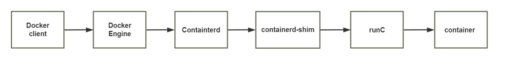

# Docker 介绍和基础操作


今天我们所说的容器是一种 IT 技术。容器其实是一种沙盒技术。

沙盒就是能够像一个集装 箱一样，把你的应用装起来。这样，应用与应用之间就有了边界而不会相互干扰;同时装在沙盒里面的应 用，也可以很方便的被搬来搬去，这也是 PaaS 想要的最理想的状态(可移植性,标准化,隔离性)。

早期的软件项目中软件更新，发布低效，开发测试发布周期很长，很 难敏捷。有了容器技术，就可以利用其标准化的特点，大幅提高生产效率。

容器技术是虚拟化、云计算、大数据之后的一门新兴的并且是炙手可热的新技术， 容器技术提高了硬件 资源利用率、 方便了企业的业务快速横向扩容（可以达到秒级快速扩容）、 实现了业务宕机自愈功能  （配合K8S可以实现，但OpenStack无此功能），因此未来数年会是一个容器愈发流行的时代 ，这是 一 个对于 IT 行业来说非常有影响和价值的技术，而对于IT行业的从业者来说， 熟练掌握容器技术无疑是一 个很有前景的行业工作机会。

## Docker 和虚拟机，物理主机


*   传统虚拟机是虚拟出一个主机硬件,并且运行一个完整的操作系统 ,然后在这个系统上安装和运行软 件
*   容器内的应用直接运行在宿主机的内核之上,容器并没有自己的内核,也不需要虚拟硬件,相当轻量化
*   每个容器间是互相隔离,每个容器内都有一个属于自己的独立文件系统,独立的进程空间,网络空间,用 户空间等,所以在同一个宿主机上的多个容器之间彼此不会相互影响

**容器和虚拟机比较**

*   资源利用率更高:  开销更小,不需要启动单独的虚拟机OS内核占用硬件资源,可以将服务器性能压榨 至极致.虚拟机一般会有5-20%的损耗,容器运行基本无损耗,所以生产中一台物理机只能运行数十个 虚拟机，但是一般可以运行数百个容器
*   启动速度更快:  可以在数秒内完成启动
*   占用空间更小: 容器一般占用的磁盘空间以MB为单位,而虚拟机以GB
*   集成性更好:  和 CI/CD（持续集成/持续部署）相关技术结合性更好，实现打包镜像发布测试可以一 键运行,做到自动化并快速的部署管理,实现高效的开发生命周期

使用虚拟机是为了更好的实现服务运行环境隔离，每个虚拟机都有独立的内核，虚拟化可以实现不同操 作系统的虚拟机，但是通常一个虚拟机只运行一个服务，很明显资源利用率比较低且造成不必要的性能 损耗，我们创建虚拟机的目的是为了运行应用程序，比如Nginx、PHP、Tomcat等web程序，使用虚拟 机无疑带来了一些不必要的资源开销，而容器技术则基于减少中间运行环节带来较大的性能提升。

根据实验，一个运行着CentOS的KVM虚拟机启动后，在不做优化的情况下，虚拟机自己就需要占用 100~200 MB内存。此外，用户应用运行在虚拟机里面，它对宿主机操作系统的调用就不可避免地要经 过虚拟化软件的拦截和处理，这本身又是一层性能损耗，尤其对计算资源、网络和磁盘I/O的损耗非常 大。

比如:  一台96G内存的物理服务器，为了运行java程序的虚拟机一般需要分配8G内存/4核的资源，只能 运行13台左右虚拟机，但是改为在docker容器上运行Java程序,每个容器只需要分配4G内存即可，同样 的物理服务器就可以运行25个左右容器，运行数量相当于提高一倍，可以大幅节省IT支出，通常情况下 至少可节约一半以上的物理设备

## Docker 的组成

[Docker: Accelerated Container Application Development](https://www.docker.com/)

[Docker Hub Container Image Library | App Containerization](https://hub.docker.com/)


*   Docker 主机(Host):  一个物理机或虚拟机，用于运行Docker服务进程和容器，也称为宿主机， node节点
*   Docker 服务端(Server):  Docker守护进程，运行docker容器 docker engine
*   Docker 客户端(Client):  客户端使用 docker 命令或其他工具调用docker API
*   Docker 镜像(Images):  镜像可以理解为创建实例使用的模板,本质上就是一些程序文件的集合
*   Docker 仓库(Registry): 保存镜像的仓库，官方仓库:  https://hub.docker.com/，可以搭建私有仓库 harbor
*    Docker 容器(Container): 容器是从镜像生成对外提供服务的一个或一组服务,其本质就是将镜像中 的程序启动后生成的进程


## Namespace

一个宿主机运行了N个容器，多个容器共用一个 OS，必然带来的以下问题:

*   怎么样保证每个容器都有不同的文件系统并且能互不影响？
*   一个docker主进程内的各个容器都是其子进程，那么如果实现同一个主进程下不同类型的子进程？ 各个容器子进程间能相互通信(内存数据)吗？
*   每个容器怎么解决IP及端口分配的问题？
*   多个容器的主机名能一样吗？
*   每个容器都要不要有root用户？怎么解决账户重名问题？


namespace是Linux系统的底层概念，在LInux内核层实现，即有一些不同类型的命名空间被部署在内 核，各个docker容器运行在同一个docker主进程并且共用同一个宿主机系统内核，各docker容器运行在 宿主机的用户空间，每个容器都要有类似于虚拟机一样的相互隔离的运行空间，但是容器技术是在一个 进程内实现运行指定服务的运行环境，并且还可以保护宿主机内核不受其他进程的干扰和影响，如文件 系统空间、网络空间、进程空间等，目前主要通过以下技术实现容器运行空间的相互**隔离**:  


*   Pid namespace
    *   不同用户的进程就是通过Pid namespace 隔离开的，且不同namespace 中可以有相同Pid。
    *   有了Pid namespace, 每个namespace 中的Pid 能够相互隔离。
*   net namespace
    *   网络隔离是通过net namespace 实现的， 每个net namespace 有独立的network devices, IP  addresses, IP routing tables, /proc/net 目录。
    *   Docker 默认采用veth 的方式将container 中的虚拟网卡同host 上的一个docker bridge: docker0  连接在一起。
*   ipc namespace
    *   Container 中进程交互还是采用linux 常见的进程间交互方法（interprocess communication –  IPC）, 包括常见的信号量、消息队列和共享内存。
    *   container 的进程间交互实际上还是host上具有相同Pid namespace 中的进程间交互，因此需要在 IPC 资源申请时加入namespace 信息- 每个IPC 资源有一个唯一的32 位ID。
*   mnt namespace
    *   mnt namespace 允许不同namespace 的进程看到的文件结构不同，这样每个namespace 中的进 程所看到的文件目录就被隔离开了
*   uts namespace
    *   UTS(“UNIX Time-sharing System”) namespace允许每个container 拥有独立的hostname 和 domain name, 使其在网络上可以被视作一个独立的节点而非Host 上的一个进程。
*   user namespace
    *   每个container 可以有不同的user 和group id, 也就是说可以在container 内部用container 内部的 用户执行程序而非Host 上的用户。

**内核的 namespace**

```shell
uname -r

grep -A10  CONFIG_NAMESPACES /boot/config-6.8.0-51-generic
CONFIG_NAMESPACES=y

lsns --help # 列出系统的命名空间

nsenter --help # 以其他程序的命名空间运行某个程序。
```

## Control groups

Linux Cgroups的全称是Linux Control Groups,是Linux内核的一个功能

如果不对一个容器做任何资源限制，则宿主机会允许其占用无限大的内存空间，有时候会因为代码bug 程序会一直申请内存，直到把宿主机内存占完，为了避免此类的问题出现，宿主机有必要对容器进行**资 源分配限制**，比如CPU、内存等

Cgroups 最主要的作用，就是限制一个进程组能够使用的资源上限，包括CPU、内存、磁盘、网络带宽 等等。此外，还能够对进程进行优先级设置，资源的计量以及资源的控制(比如:将进程挂起和恢复等操 作)。

```shell
grep -A10  CGROUP /boot/config-6.8.0-51-generic 
CONFIG_CGROUPS=y
```

## 容器管理工具

有了以上的namespace、cgroups就具备了基础的容器运行环境，但是还需要有相应的容器创建与删除 的管理工具、以及怎么样把容器运行起来、容器数据怎么处理、怎么进行启动与关闭等问题需要解决， 于是容器管理技术出现了。目前主要是使用docker，containerd等，早期使用 LXC


### LXC

LXC:  Linux Container。可以提供轻量级的虚拟化功能,以便隔离进程和资源,包括一系列容器的管理工具 软件,如，lxc-create,lxc-start,lxc-attach等,但这技术功能不完善,目前较少使用

[Linux Containers](https://linuxcontainers.org/)

### docker

Docker 相当于增强版的LXC,功能更为强大和易用,也是当前最主流的容器前端管理工具

Docker 先启动一个容器也需要一个外部模板，也称为镜像，docke的镜像可以保存在一个公共的地方共 享使用，只要把镜像下载下来就可以使用，最主要的是可以在镜像基础之上做自定义配置并且可以再把 其提交为一个镜像，一个镜像可以被启动为多个容器。


Docker的镜像是分层的，镜像底层为库文件且只读层即不能写入也不能删除数据，从镜像加载启动为一 个容器后会生成一个可写层，其写入的数据会复制到宿主机上对应容器的目录，但是容器内的数据在删 除容器后也会被随之删除。

### pouch

[AliyunContainerService/pouch: An Efficient Enterprise-class Container Engine](https://github.com/AliyunContainerService/pouch)

Pouch （小袋子）起源于 2011 年，并于2017年11月19日上午，在中国开源年会现场，阿里巴巴正式开 源了基于 Apache 2.0 协议的容器技术 Pouch。Pouch 是一款轻量级的容器技术，拥有快速高效、可移 植性高、资源占用少等特性，主要帮助阿里更快的做到内部业务的交付，同时提高超大规模下数据中心 的物理资源利用率

目前的容器方案大多基于 Linux 内核提供的 cgroup 和 namespace 来实现隔离，然后这样轻量级方案 存在弊端: 

*   容器间，容器与宿主间，共享同一个内核
*   内核实现的隔离资源，维度不足

面对如此的内核现状，阿里巴巴采取了三个方面的工作，来解决容器的安全问题:

*   用户态增强容器的隔离维度，比如网络带宽、磁盘使用量等
*   给内核提交 patch，修复容器的资源可见性问题，cgroup 方面的 bug
*   实现基于 Hypervisor 的容器，通过创建新内核来实现容器隔离

### Podman

虽然目前 Docker 是管理 Linux 容器最好的工具，注意没有之一，但是podman的横空出现即将改变这 一点

Podman即Pod Manager tool，从名称上可以看出和kubernets的pod的密切联系，不过就其功能来 说，简而言之:   alias docker = podman ,是CentOS 8 新集成的功能，或许不久的未来会代替docker

 Podman是一个 为 Kubernetes 而生的开源的容器管理工具，原来是 CRI-O（即容器运行时接口CRI 和 开放容器计划OCI） 项目的一部分，后来被分离成一个单独的项目叫 libpod。其可在大多数Linux平台 上使用，它是一种无守护程序的容器引擎，用于在Linux系统上开发，管理和运行任何符合Open  Container Initiative（OCI）标准的容器和容器镜像。

Podman 提供了一个与Docker兼容的命令行前端，Podman 里面87%的指令都和Docker CLI 相同，因 此可以简单地为Docker CLI别名，即“ alias docker = podman”，事实上，podman使用的一些库也是 docker的一部分。

[Podman](https://podman.io/)

Podman 和docker不同之处


### Containerd 工具

ctr 是由 containerd 提供的一个客户端工具

nerdctl 是 与 Docker 兼容的CLI for Containerd，其支持Compose

nerdctl 和 docker命令行语法很相似，学习比较容易

https://github.com/containerd/nerdctl

## Docker 的优势

*   快速部署:  短时间内可以部署成百上千个应用，更快速交付到线上 
*   高效虚拟化:  不需要额外hypervisor支持，基于linux内核实现应用虚拟化，相比虚拟机大幅提高性 能和效率 
*   节省开支:  提高服务器利用率，降低IT支出 
*   简化配置:  将运行环境打包保存至容器，使用时直接启动即可 
*   环境统一:  将开发，测试，生产的应用运行环境进行标准化和统一，减少环境不一样带来的各种问 题 
*   快速迁移和扩展:  可实现跨平台运行在物理机、虚拟机、公有云等环境，良好的兼容性可以方便将 应用从A宿主机迁移到B宿主机，甚至是A平台迁移到B平台 
*   更好的实现面向服务的架构,推荐一个容器只运行一个应用,实现分布的应用模型,可以方便的进行横 向扩展,符合开发中高内聚,低耦合的要求,减少不同服务之间的相互影响

## Docker 的缺点

*   多个容器共用宿主机的内核，各应用之间的隔离不如虚拟机彻底
*   由于和宿主机之间的进程也是隔离的,需要进入容器查看和调试容器内进程等资源,变得比较困难和 繁琐
*   如果容器内进程需要查看和调试,需要在每个容器内都需要安装相应的工具,这也造成存储空间的重 复浪费

## 容器的相关技术

### 容器规范


[Open Container Initiative - Open Container Initiative](https://opencontainers.org/)

为了保证容器生态的标准性和健康可持续发展，包括Linux 基金会、Docker、微软、红帽、谷歌和IBM 等公司在2015年6月共同成立了一个叫Open Container Initiative（OCI）的组织，其目的就是制定开放 的标准的容器规范

目前OCI一共发布了两个规范，分别是runtime spec和 image format spec，有了这两个规范，不同 的容器公司开发的容器只要兼容这两个规范，就可以保证容器的可移植性和相互可操作性。

### 容器 runtime

**运行容器的环境**

runtime是真正运行容器的地方，因此为了运行不同的容器runtime需要和操作系统内核紧密合作相互在 支持，以便为容器提供相应的运行环境

对于容器运行时主要有两个级别：Low Level(使用接近内核层) 和 High Level(使用接近用户层)目前，市 面上常用的容器引擎有很多，主要有下图的那几种


dockershim, **containerd** 和cri-o都是遵循CRI的容器运行时，我们称他们为高层级运行时（High-level  Runtime）

其他的容器运营厂商最底层的**runc**仍然是Docker在维护的。

Google,CoreOS,RedHat都推出自已的运行时:lmctfy,rkt,cri-o,但到目前Docker仍然是最主流的容器引擎 技术。

runtime 类型:  

*   Lxc:  linux上早期的runtime，在 2013 年 Docker 刚发布的时候,就是采用lxc作为runtime, Docker 把 LXC 复杂的容器创建与使用方式简化为 Docker 自己的一套命令体系。随着Docker的发展，原 有的LXC不能满足Docker的需求,比如跨平台功能
*   Libcontainer: 随着 Docker 的不断发展，重新定义容器的实现标准，将底层实现都抽象化到  Libcontainer 的接口。这就意味着，底层容器的实现方式变成了一种可变的方案，无论是使用namespace、cgroups 技术抑或是使用 systemd 等其他方案，只要实现了 Libcontainer 定义的一 组接口，Docker 都可以运行。这也为 Docker 实现全面的跨平台带来了可能。
*   runc:  早期libcontainer是Docker公司控制的一个开源项目，OCI的成立后,Docker把libcontainer 项目移交给了OCI组织,runC就是在libcontainer的基础上进化而来,目前Docker默认的runtime， runc遵守OCI规范
*   rkt:  是CoreOS开发的容器runtime，也符合OCI规范，所以使用rktruntime也可以运行Docker容 器

Docker 的运行机制



```shell
# 查看docker的 runtime
docker info
Runtimes: runc         #Runtimes
Default Runtime: runc  #runtime
```

### 镜像仓库 Registry

统一保存镜像而且是多个不同镜像版本的地方，叫做镜像仓库

*   Docker hub:  docker官方的公共仓库，已经保存了大量的常用镜像，可以方便大家直接使用 
*   阿里云，网易等第三方镜像的公共仓库 
*   Image registry:  docker 官方提供的私有仓库部署工具，无web管理界面，目前使用较少 
*   Harbor:  vmware 提供的自带web界面自带认证功能的镜像私有仓库，目前有很多公司使用

### 容器编排工具


当多个容器在多个主机运行的时候，单独管理容器是相当复杂而且很容易出错，而且也无法实现某一台 主机宕机后容器自动迁移到其他主机从而实现高可用的目的，也无法实现动态伸缩的功能，因此需要有 一种工具可以实现统一管理、动态伸缩、故障自愈、批量执行等功能，这就是容器编排引擎

容器编排通常包括容器管理、调度、集群定义和服务发现等功能

*   Docker compose : docker 官方实现单机的容器的编排工具
*   Docker swarm:  docker 官方开发的容器编排引擎,支持overlay network
*    Mesos+Marathon:  Mesos是Apache下的开源分布式资源管理框架，它被称为是分布式系统的内 核。Mesos最初是由加州大学伯克利分校的AMPLab开发的，后在Twitter得到广泛使用。通用的集 群组员调度平台，mesos(资源分配)与marathon(容器编排平台)一起提供容器编排引擎功能
*   Kubernetes:  google领导开发的容器编排引擎，内部项目为Borg，且其同时支持 docker 和  CoreOS,当前已成为容器编排工具事实上的标准