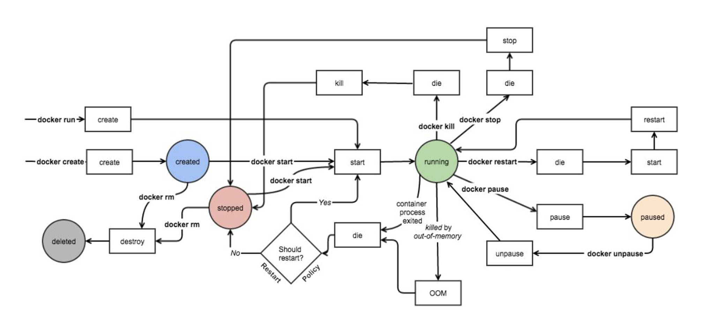

[Docker: Accelerated Container Application Development](https://www.docker.com/)

# Docker 安装

## 包安装

[moby/moby: The Moby Project - a collaborative project for the container ecosystem to assemble container-based systems](https://github.com/moby/moby)

CE（Docker Community Edition，社区版本）和 EE（Docker Enterprise Edition，企业收费版），CE 社区版本和 EE 企业版本都是每个季度发布一个新版本，但是 EE 版本提供后期安全维护 1 年，而 CE 版本是 4 个月

[Install | Docker Docs](https://docs.docker.com/engine/install/)

阿里云安装文档：[docker-ce 镜像_docker-ce 下载地址_docker-ce 安装教程-阿里巴巴开源镜像站](https://developer.aliyun.com/mirror/docker-ce?spm=a2c6h.13651102.0.0.3e221b11guHCWE)

apt 仓库

```shell
Add Docker's official GPG key:
sudo apt-get update
sudo apt-get install ca-certificates curl
sudo install -m 0755 -d /etc/apt/keyrings
sudo curl -fsSL https://download.docker.com/linux/ubuntu/gpg -o /etc/apt/keyrings/docker.asc
sudo chmod a+r /etc/apt/keyrings/docker.asc

# Add the repository to Apt sources:
echo \
  "deb [arch=$(dpkg --print-architecture) signed-by=/etc/apt/keyrings/docker.asc] https://download.docker.com/linux/ubuntu \
  $(. /etc/os-release && echo "${UBUNTU_CODENAME:-$VERSION_CODENAME}") stable" | \
  sudo tee /etc/apt/sources.list.d/docker.list > /dev/null
sudo apt-get update
```

安装

```shell
sudo apt-get install docker-ce docker-ce-cli containerd.io docker-buildx-plugin docker-compose-plugin

# 指定版本
apt install docker-ce=5:20.10.10~3-0~ubuntu-focal docker-ce
cli=5:20.10.10~3-0~ubuntu-focal
```

验证

```shell
sudo docker run hello-world
```

删除 docker

```shell
apt purge docker-ce
rm -rf /var/lib/docker

for pkg in docker.io docker-doc docker-compose docker-compose-v2 podman-docker containerd runc; do sudo apt-get remove $pkg; done
```

 内置仓库安装 docker

```shell
apt -y install docker.io
```

在 CentOS8 上安装 docker 会自动安装 podman, docker 工具只是一个脚本，调用了 Podman

## 二进制离线安装

[Binaries | Docker Docs](https://docs.docker.com/engine/install/binaries/)

二进制安装下载路径

[Index of linux/static/stable/](https://download.docker.com/linux/static/stable/?_gl=1*4kfoct*_gcl_au*OTE5MDUzODY2LjE3Mzk0OTU0MjI.*_ga*MTU0NTY3NzAzMi4xNzM5NDk1NDIy*_ga_XJWPQMJYHQ*MTczOTUzNDExMC4zLjEuMTczOTUzNTU0Mi41Ny4wLjA.)

[docker-ce-linux-static-stable-x86_64 安装包下载_开源镜像站-阿里云](https://mirrors.aliyun.com/docker-ce/linux/static/stable/x86_64/)

```shell
wget https://download.docker.com/linux/static/stable/x86_64/docker-27.5.1.tgz

tar xvf docker-27.5.1.tgz

cp docker/* /usr/local/bin/
```

启动

```shell
dockerd &>/dev/null &

docker version

docker run hello-world
```

服务文件

```shell
cat > /lib/systemd/system/docker.service <<-EOF
[Unit]
Description=Docker Application Container Engine
Documentation=https://docs.docker.com
After=network-online.target firewalld.service
Wants=network-online.target

[Service]
Type=notify
# the default is not to use systemd for cgroups because the delegate issues still
# exists and systemd currently does not support the cgroup feature set required
# for containers run by docker
ExecStart=/usr/local/bin/dockerd -H unix://var/run/docker.sock
ExecReload=/bin/kill -s HUP \$MAINPID
# Having non-zero Limit*s causes performance problems due to accounting overhead
# in the kernel. We recommend using cgroups to do container-local accounting.
LimitNOFILE=infinity
LimitNPROC=infinity
LimitCORE=infinity
# Uncomment TasksMax if your systemd version supports it.
# Only systemd 226 and above support this version.
#TasksMax = infinity
TimeoutStartSec=0
# set delegate yes so that systemd does not reset the cgroups of docker containers
Delegate=yes
# kill only the docker process, not all processes in the cgroup
KillMode=process
# restart the docker process if it exits prematurely
Restart=on-failure
StartLimitBurst=3
StartLimitInterval=60s

[Install]
WantedBy=multi-user.target

root@loong:~# systemctl daemon-reload 
root@loong:~# systemctl start docker.service
```

docker 命令补全

```shell
wget -P /etc/bash_completion.d https://github.com/l00ng-n1/-shell-/blob/main/docker%E5%91%BD%E4%BB%A4%E8%A1%A5%E5%85%A8/docker_completion
```

配置文件

```shell
 mkdir -p /etc/docker
tee /etc/docker/daemon.json <<-'EOF'
    {
      "registry-mirrors": ["https://docker.m.daocloud.io","https://docker.1panel.live","https://docker.1ms.run","https://docker.xuanyuan.me"],
      "insecure-registries": [""]
     }
EOF
 
 # 镜像加速(代理)
 # http 地址
```

## 官方通用安装 Docker 脚本

```shell
curl -fsSL get.docker.com -o get-docker.sh
sh get-docker.sh --mirror Aliyun
```

# Docker 程序环境


环境配置文件:

```shell
 /etc/sysconfig/docker-network
 /etc/sysconfig/docker-storage
 /etc/sysconfig/docker
```

 Unit File:

```shell
/usr/lib/systemd/system/docker.service
```

 docker-ce 配置文件:

```shell
/etc/docker/daemon.json
```

Docker Registry 配置文件:

```shell
/etc/containers/registries.conf
```

Docker 根目录

```shell
ls /var/lib/docker/
```

查看 docker 相关文件

```shell
dpkg -L docker-ce
dpkg -L docker-ce-cli

rpm -ql docker-ce
rpm -ql docker-ce-cli
```

# Docker 命令帮助

docker 命令是最常使用的 docker 客户端命令，其后面可以加不同的参数以实现不同的功能

docker 命令有很多子命令，可以用下面方法查看帮助

```shell
docker  --help

docker COMMAND --help

docker run --help
docker image --help
docker network --help
```

# Docker 相关信息和优化配置

## Docker 相关信息

```shell
docker version

docker info
```


范例: 解决上述 SWAP 报警提示

```shell
docker info
WARNING: No swap limit support 

vim /etc/default/grub
GRUB_CMDLINE_LINUX="net.ifnames=0 biosdevname=0 swapaccount=1"  #修改此行

update-grub
reboot
```

## 查看 docker0 网卡

```shell
ip a
# 有个 docker0 网桥网卡
docker0

root@loong:~# route -n
Kernel IP routing table
Destination     Gateway         Genmask         Flags Metric Ref    Use Iface
0.0.0.0         10.0.0.2        0.0.0.0         UG    0      0        0 eth0
10.0.0.0        0.0.0.0         255.255.255.0   U     0      0        0 eth0
172.17.0.0      0.0.0.0         255.255.0.0     U     0      0        0 docker0

apt install bridge-utils
root@loong:~# brctl show
bridge name     bridge id               STP enabled     interfaces
docker0         8000.0242ce758374       no
```

## docker 存储引擎

*    AUFS:  （Advanced Mult-Layered Unification Filesystem，版本 2 之前旧称 AnotherUnionFS）是 一种 Union FS ，是文件级的存储驱动。Aufs 是之前的 UnionFS 的重新实现，2006 年由 Junjiro  Okajima 开发

    所谓 UnionFS 就是把不同物理位置的目录合并 mount 到同一个目录中。简单来说就是支持将不同 目录挂载到一个虚拟文件系统下的。这种可以层层地叠加修改文件。无论底下有多少都是只读的， 最上系统可写的。当需要修改一个文件时， AUFS 创建该文件的一个副本，使用 CoW 将文件从只 读层复制到可写进行修改，结果也保存在 Docker 中，底下的只读层就是 image，可写层就是  Container

    aufs 被拒绝合并到主线 Linux 。其代码被批评为 "dense, unreadable, uncommented 密集、不可 读、未注释"。 相反，OverlayFS 被合并到 Linux 内核中。在多次尝试将 aufs 合并到主线内核失败 后，作者放弃了

    AUFS 是 Docker 18.06 及更早版本的首选存储驱动程序，在内核 3.13 上运行 Ubuntu 14.04 时不 支持 overlay2

*   Overlay:  一种 Union FS 文件系统， Linux 内核 3.18 后支持

*   **Overlay2**: Overlay 的升级版，到目前为止，所有 Linux 发行版推荐使用的存储类 型，也是 docker 默认使用的存储引擎为 overlay2，需要磁盘分区支持 d-type 功能，因此需要系统磁盘的额外支持, 相 对 AUFS 来说 Overlay2 有以下优势:  更简单地设计； 从 3.18 开始就进入了 Linux 内核主线；资源消 耗更少

*   devicemapper:  因为 CentOS 7.2 和 RHEL 7.2 的之前版本内核版本不支持 overlay2，默认使用的存 储驱动程序，最大数据容量只支持 100GB 且性能不佳，当前较新版本的 CentOS 已经支持 overlay2， 因此推荐使用 overlay2, 另外此存储引擎已在 Docker Engine 18.09 中弃用

*   ZFS(Sun -2005)/btrfs(Oracle-2007):  目前没有广泛使用

*   vfs:  用于测试环境，适用于无法使用 copy-on -writewrite 时的情况。 此存储驱动程序的性能很 差，通常不建议用于生产

`overlay2` 驱动利用 OverlayFS 的层叠功能，通过在多个文件系统层之间创建合并视图来工作。其主要结构包括：

1.  **Lower Layer（下层）**：通常为基础镜像文件系统。
2.  **Upper Layer（上层）**：存放容器创建或修改的文件。
3.  **Merged Layer（合并层）**：视图合并了上层和下层的内容，用户看到的就是合并后的文件系统。

当容器需要读写文件时：

-   **读取操作**：如果文件存在于 **上层**，则从上层读取；如果上层没有，则从 **下层** 读取。
-   **写入操作**：写操作首先修改上层的副本（copy-on-write），不影响下层的内容。

将多个文件系统挂在同一目录下

## Docker 优化配置

```shell
vim /etc/docker/daemon.json

{
 "registry-mirrors": [
 "https://registry.docker-cn.com",
 "http://hub-mirror.c.163.com",
 "https://docker.mirrors.ustc.edu.cn",
 "https://si7y70hh.mirror.aliyuncs.com/"
  ],
 #开启远程:https://docs.docker.com/config/daemon/remote-access/ 或者 ExecStart =/usr/bin/dockerd -H tcp://0.0.0.0:2375 -H fd:// 
 
"hosts": ["unix:///var/run/docker.sock", "tcp://10.0.0.10:2375"], 
"insecure-registries": ["harbor.wang.org"],
 "exec-opts": ["native.cgroupdriver = systemd"],
 "data-root": "/data/docker", #指定 docker 数据目录, 实现方法 2：ExecStart =/usr/bin/dockerd --data-root =/data/docker 
"max-concurrent-downloads": 10, 
"max-concurrent-uploads": 5,  

"log-opts": {
 "max-size": "300m",   #指定容器日志文件的最大值
 "max-file": "2", #指定容器日志文件的个数，循环写入日志文件，即一个日志满，会写入第二个文件
 },
 
 "live-restore": true, #docker.service 重启，不影响容器的运行
 
 "proxies": {  # 代理 https://docs.docker.com/network/proxy/
   "default": {
     "httpProxy": "http://proxy.example.com: 3128",
     "httpsProxy": "https://proxy.example.com: 3129",
     "noProxy": "*.test.example.com,.example.org,127.0.0.0/8 "
   }
   "tcp://docker-daemon1.example.com": {
     "noProxy": "*.internal.example.net "
   }
 }
}
```

开启远程连接

``` shell
vim /lib/systemd/system/docker.service

ExecStart =/usr/local/bin/dockerd -H unix://var/run/docker.sock -H tcp://0.0.0.0:2375

#在另一台 docker 客户端主机远程连接服务器
docker -H <docker服务器IP>: 2375 version
```

通过ssh 协议远程连接

``` shell
# 10.0.0.100 服务器
ssh-keygen
ssh-copy-id 10.0.0.100

docker -H ssh://root@10.0.0.100 version
```

# 容器镜像管理

## 镜像结构和原理


镜像即创建容器的模版，含有启动容器所需要的文件系统及所需要的内容，因此镜像主要用于方便和快 速的创建并启动容器

镜像含里面是一层层的文件系统,叫做 Union FS（联合文件系统）,联合文件系统，可以将几层目录挂载 到一起（就像千层饼，洋葱头，俄罗斯套娃一样），形成一个虚拟文件系统,虚拟文件系统的目录结构就 像普通 linux 的目录结构一样，镜像通过这些文件再加上宿主机的内核共同提供了一个 linux 的虚拟环 境，每一层文件系统叫做一层 layer，联合文件系统可以对每一层文件系统设置三种权限，只读 （readonly）、读写（readwrite）和写出（whiteout-able），但是镜像中每一层文件系统都是只读的, 构建镜像的时候，从一个最基本的操作系统开始，每个构建提交的操作都相当于做一层的修改，增加了 一层文件系统，一层层往上叠加，上层的修改会覆盖底层该位置的可见性，这也很容易理解，就像上层 把底层遮住了一样，当使用镜像的时候，我们只会看到一个完全的整体，不知道里面有几层,实际上也不 需要知道里面有几层，结构如下: 

一个典型的 Linux文件系统由 bootfs 和 rootfs 两部分组成

*   bootfs(boot file system) 主要包含bootloader和kernel，bootloader主要用于引导加载 kernel，Linux 刚启动时会加载bootfs文件系统,当boot加载完成后,kernel 被加载到内存中后接管系统的控制权,bootfs 会被 umount 掉
*   rootfs (root file system) 包含的就是典型 Linux 系统中的/dev，/proc，/bin，/etc 等标准目录和文件， 不同的 linux 发行版（如 ubuntu 和 CentOS ) 主要在 rootfs 这一层会有所区别

一般的镜像通常都比较小，官方提供的Ubuntu镜像只有60MB多点，而 CentOS 基础镜像也只有200MB 左右，一些其他版本的镜像甚至只有几MB，比如:  busybox 才1.22MB，alpine镜像也只有5M左右。镜 像直接调用宿主机的内核，镜像中只提供 rootfs，也就是只需要包括最基本的命令,配置文件和程序库等 相关文件就可以了

下图就是有两个不同的镜像在一个宿主机内核上实现不同的rootfs。


容器、镜像和父镜像关系:  


``` shell
docker pull nginx
#查看镜像分层历史, 镜像的每一层（layer）及其构建信息。
docker image  history nginx

# 供有关 nginx 镜像的详细信息，包括镜像的配置、环境变量、端口暴露、挂载点、依赖的镜像等。
docker inspect nginx
```

## 搜索镜像

```
http://hub.docker.com
http://dockerhub.com
https://hub-stage.docker.com/
```

执行docker search命令进行搜索

``` shell
docker search centos

#搜索点赞 100 个以上的镜像
docker  search --filter = stars = 100 centos
```

#  Alpine 介绍

Alpine 操作系统是一个面向安全的轻型 Linux 发行版。它不同于通常 Linux 发行版，Alpine 采用了  musl libc 和 busybox 以减小系统的体积和运行时资源消耗，但功能上比 busybox 又完善的多，因此得 到开源社区越来越多的青睐。在保持瘦身的同时，Alpine 还提供了自己的包管理工具 apk，可以通过 https://pkgs.alpinelinux.org/packages 网站上查询包信息，也可以直接通过 apk 命令直接查询和安装各 种软件。


目前 Docker 官方已开始推荐使用 Alpine 替代之前的 Ubuntu 做为基础镜像环境。这样会带来多个好 处。包括镜像下载速度加快，镜像安全性提高，主机之间的切换更方便，占用更少磁盘空间等。


*   Alpine 官网:   https://www.alpinelinux.org/ 
*   Alpine 官方仓库:    https://github.com/alpinelinux
*   Alpine 官方镜像:   https://hub.docker.com/_/alpine/ 
*   Alpine 官方镜像仓库:   https://github.com/gliderlabs/docker-alpine

``` shell
#更新源
apk update = apt update

#安装软件
apk add vim = apt install vim

#删除软件
apk del openssh openntp vim = apt remove openssh

#安装常见软件
apk update && apk --no-cache add bash curl telnet  wget net-tools pstree  zip unzip 

#安装常用编译工具
apk update && apk --no-cache add gcc make curl zip unzip net-tools pstree wget libgcc libc-dev libcurl libc-utils pcre-dev zlib-dev  libnfs  pcre pcre2 libevent libevent-dev iproute2 

#修改时区
apk update && apk --no-cache add tzdata  && ln -s  /usr/share/zoneinfo/Asia/Shanghai /etc/localtime && echo "Asia/Shanghai" > /etc/timezone
```

# Debian(ubuntu)系统建议安装的基础包

在很多软件官方提供的镜像都使用的是Debian(ubuntu)的系统,比如:nginx,tomcat,mysql,httpd 等,但镜 像内缺少很多常用的调试工具.当需要进入容器内进行调试管理时,可以安装以下常用工具包

``` shell
apt update                #安装软件前需要先更新索引
apt install procps        #提供 top, ps, free 等命令
apt install psmisc        #提供 pstree, killall 等命令
apt install iputils-ping  #提供 ping 命令
apt install net-tools     #提供 netstat 网络工具等
```

# 镜像

## 下载镜像

``` shell
docker pull [OPTIONS] NAME [: TAG|@DIGEST]
# NAME: 是镜像名, 一般的形式  仓库服务器: 端口/项目名称/镜像名称
# : TAG: 即版本号, 如果不指定: TAG, 则下载最新版镜像

# 下载公有云的镜像
docker pull registry.cn-beijing.aliyuncs.com/wangxiaochun/alpine: 3.20.

docker pull hello-world

# 明确写上版本号，做好版本区分
```

镜像下载保存的路径:  

```
/var/lib/docker/overlay2/镜像 ID
```

注意:  镜像下载完成后，会自动解压缩，比官网显示的可能会大很多

## 查看镜像

``` shell
docker images
docker image ls

REPOSITORY      #镜像所属的仓库名称
TAG             #镜像版本号（标识符），默认为 latest
IMAGE ID        #镜像唯一 ID 标识, 如果 ID 相同, 说明是同一个镜像有多个名称
CREATED         #镜像在仓库中被创建时间
VIRTUAL SIZE    #镜像的大小

#显示完整的 ImageID
docker images --no-trunc

#只查看指定 REPOSITORY 的镜像
docker images tomcat

#只查看镜像的 REPOSITORY 和 TAG
docker image ls --format "{{.Repository}}:{{.Tag}}"

# 查看指定镜像的详细信息
docker inspect alpine: 3.16.2

# 查看 dangling 状态的镜像
# dangling images 表示 TAG 为 <none> 的镜像
docker images  -f dangling = true
```

Repository仓库

*   由某特定的docker镜像的所有迭代版本组成的镜像仓库 
*   一个Registry中可以存在多个Repository 
*   Repository可分为“顶层仓库”和“用户仓库” 
*   Repository用户仓库名称一般格式为“用户名/仓库名” 
*   每个Repository仓库可以包含多个Tag(标签),每个标签对应一个镜像

## 镜像导出

利用docker save命令可以将从本地镜像导出为一个打包 tar文件，然后复制到其他服务器进行导入使用

注意：镜像导出支持多个镜像导出

``` shell
#导出为 tar 格式
docker save -o /path/file.tar IMAGE1 IMAGE2 ...
docker save IMAGE1 IMAGE2 ... > /path/file.tar

#导出为压缩格式
docker save IMAGE1 IMAGE2 ... | gzip > /path/file.tar.gz

# 导出所有镜像至不同的文件中
docker images | awk 'NR!= 1{print $1,$ 2}' | while read repo tag; do docker save   $repo:$ tag -o /opt/$repo-$ tag.tar ; done 

# 导出所有镜像到一个打包文件
#方法 1: 使用 image ID 导出镜像, 在导入后的镜像没有 REPOSITORY 和 TAG, 显示为 <none>
docker save `docker images -qa` -o all.tar

#方法 2: 将所有镜像导入到一个文件中, 此方法导入后可以看 REPOSITORY 和 TAG
docker save `docker images | awk 'NR!=1{print $1":"$2}'` -o all.tar
docker save `docker images | awk 'NR!=1{print $1":"$2}'` | gzip >  all.tar.gz

#方法 3: 将所有镜像导入到一个文件中, 此方法导入后可以看 REPOSITORY 和 TAG
docker image save `docker image ls --format "{{.Repository}}:{{.Tag}}"` -o all.tar
docker image save `docker image ls --format "{{.Repository}}: {{.Tag}}"` | gzip > all.tar.gz
```

## 镜像导入

利用docker load命令可以将镜像导出的打包或压缩文件再导入

注意：镜像导入只能支持单个包或压缩文件导入，不支持多个包或压缩文件导入

``` shell
docker load -i /path/file.tar
docker load < /path/file.tar.gz


```

## 镜像删除

``` shell
docker rmi -f `docker images -q`

# -f 强制，不确认

# image ID
docker rmi b59811

docker rmi alpine: 3.11.3

docker rmi nginx tomcat

# 旧版本强制删除正在使用的镜像，也会删除对应的容器，新版本不允许删除正在运行的容器对应的镜像

# 查看正在运行的容器
docker ps -a

 #如果容器停止，则可以删除镜像，但只是逻辑删除，即删除了镜像名称无法再使用，但实际不会释放镜像的空间

```

## 清理dangling状态的镜像

dangling images表示TAG为\<none\>的镜像

``` shell
# 列出 ID
docker images -q -f dangling = true

docker rmi -f `docker images -q -f dangling=true`

# 清除 dangling 和不再使用的镜像
docker image prune -a -f

# 清除 dangling 镜像
docker image prune -f

# 给 none 加名字与 tag
docker tag <image ID> <newName>: <newTage>
```

## 镜像打标签

``` shell
docker tag SOURCE_IMAGE [: TAG] TARGET_IMAGE [: TAG]
# TAG 默认为 latest

docker tag  alpine alpine: 3.11
```

## 代理

利用下面网站做代理，可以实现拉取原本从国内可能无法直接访问的镜像

```
https://docker.aityp.com/
https://dockerproxy.com/
https://dockerproxy.net/
https://github.com/DaoCloud/public-image-mirror
https://github.com/kubesre/docker-registry-mirrors/
```

# 容器操作基础命令

容器生命周期



``` shell
docker container -help
```

image是静态文件的集合

container是将静态文件加载到内存，表现为进程

## 启动容器

docker run = docker create + docker start

docker run 可以启动容器，进入到容器，并随机生成容器ID和名称

``` shell
docker run hello-world

docker ps -a
```


``` shell
docker run [选项]  [镜像名]  [shell 命令] [参数]

-i, --interactive #Keep STDIN open even if not attached，通常和-t 一起使用
-t, --tty #分配 pseudo-TTY，通常和-i 一起使用, 注意对应的容器必须运行 shell 才支持进入
-d, --detach # 台后运行, 默认前台
--name string
--h, --hostname string
--rm # Automatically remove the container when it exits 注意: 此选项会自动删除匿名卷
-p   # 端口映射
-P   # Publish all exposed ports to random ports
--dns list # Set custom DNS servers
--entrypoint string # 
--restart policy
--privileged  # container 内的 root 拥有真正的 root 权限。
-e， --env = [] # Set environment variables
--env-file = []
--sysctl net.ipv4.ip_unprivileged_port_start = 0 #指定容器的内核参数, 但不修改宿主机内核
--ulimit ulimit #指定 ulimit 限制配置，比如： --ulimit nofile = 10240:10240
[shell 命令] [参数]   #使用指定的命令和参数，替换容器默认的命令
```

--restart 可以指定四种不同的policy

*   no 除此值外，以下三值都和--rm冲突
*   on failure[:max-retries]
*   always
*   unless-stopped

如果 docker stop 停止容器后重启宿主机，always选项以外的其它选项的容器都不会随着宿主机启动而 自动启动

注意: 容器启动后,如果容器内没有前台运行的进程,将自动退出停止


``` shell
# 从容器内退出, 并停止容器
exit
# 从容器内退出, 且容器不停止
同时按三个键，ctrl+p+q
```

运行容器

``` shell
docker run  busybox echo "Hello wang"

docker run --name a1 alpine

# 运行交互式容器并退出
docker run -it docker.io/busybox  sh
#用 exit 退出后容器也停止
#用同时按三个键 ctrl+p+q 退出后容器不会停止

# 设置容器内的主机名
docker run -it --name a1 -h a1.wang.org alpine 

# 一次性运行容器，退出后立即删除，用于测试
docker run  --rm  alpine cat /etc/issue

# 启动后台守护式容器
docker run -d nginx

# 容器后台执行不退出条件：
# 1.容器内进程持续运行
# 2.容器内进程前台运行

#有些容器后台启动不会持续运行
docker run -d --name alpine4 alpine  # Exited
docker run -td --name alpine5 alpine # Up

# 开机自动运行容器
docker run -d --name nginx --restart = always -p 80:80  nginx

# 修改容器的内核参数
docker run --name pod-test  -d wangxiaochun/pod-test: v0.1
docker exec  pod-test sysctl net.ipv4.icmp_echo_ignore_all
docker run --name pod-test  --sysctl net.ipv4.icmp_echo_ignore_all = 1 -d wangxiaochun/pod-test: v0.1
docker exec  pod-test sysctl net.ipv4.icmp_echo_ignore_all

# 指定 ulimit 配置
#10000 为 soft,10240 为 hard, 注意：ulimit soft limit must be less than or equal to hard limit
docker run --ulimit nofile = 10000:10240 --rm debian sh -c "ulimit -a"
```

**--privileged 选项**

--privileged 选项被引入docker。使用该参数，container内的root拥有真正的root权限。

否则，container内的root只是外部的一个普通用户权限。privileged启动的容器，可以看到很多host上 的设备，并且可以执行mount。甚至允许你在docker容器中启动docker容器。

## 查看容器信息

### 显示当前存在容器

``` shell
docker ps [OPTIONS]
docker container ls [OPTIONS]

-a, --all
-q, --quiet Only display numeric IDs
-s, --size
-n, --last int

docker ps  -f 'status = exited'

```

### 查看容器内的进程

``` shell
docker top CONTAINER [ps OPTIONS]

docker top db144f19
```

### 查看容器资源使用情况

``` shell
docker stats 251c7c7cf2aa

#默认启动 elasticsearch 会使用较多的内存
docker run -d --name elasticsearch -p 9200:9200 -p 9300:9300 -e "discovery.type = single-node" elasticsearch: 7.6.2

curl 10.0.0.100:9200

docker stats

# 限制内存使用大小
docker run -d --name elasticsearch -p 9200:9200 -p 9300:9300 -e "discovery.type = single-node" -e ES_JAVA_OPTS = "-Xms64m -Xmx128m" elasticsearch: 7.6.2
```

### 查看容器的详细信息

``` shell
docker inspect [OPTIONS] NAME|ID [NAME|ID...]

docker inspect 9997

docker inspect --format "{{.Created}}" web01
```

### 查看容器的日志

docker logs 可以查看容器中运行的进程在控制台的标准输出和标准错误，一般对应是日志信息

docker 日志是存放在宿主机的 /var/lib/docker/containers/<container_id>/<container_id>-json.log文 件中

``` shell
docker logs [OPTIONS] CONTAINER

docker logs  5126

docker logs --tail 3 5126

 #显示时间
docker logs --tail 0 -t 5126

#持续跟踪
docker logs -f 5126
```

## 删除容器

``` shell
docker rm [OPTIONS] CONTAINER [CONTAINER...]
docker container rm [OPTIONS] CONTAINER [CONTAINER...]

# 删除停止的容器
docker container prune

docker rm 3a05bbf66dac
docker rm alpine5

docker rm -f  alpine5

docker rm -f `docker ps -a -q`
docker rm -f `docker ps -q  -f status=running`

# 删除所有停止的容器
docker rm `docker ps -qf status=exited`

```

.bashrc

```
alias rmc ='docker rm -f `docker ps -a -q`' 
```


## 容器的启动和停止

``` shell
docker start|stop|restart|pause|unpause 容器 ID
```

批量正常启动或关闭所有容器

``` shell
docker start $(docker ps -a -q)  
docker stop $(docker ps -a -q) 
```

启动并进入容器

``` shell
root@loong:~# docker run --name = c1 -it ubuntu: noble-20250127 bash
root@616b8a6c74e2:/# exit
exit
root@loong:~# docker start c1
c1
root@loong:~# docker ps -a
CONTAINER ID   IMAGE                   COMMAND   CREATED          STATUS         PORTS     NAMES
616b8a6c74e2   ubuntu: noble-20250127   "bash"    10 seconds ago   Up 2 seconds             c1
root@loong:~# docker stop c1
c1
root@loong:~# docker ps -a
CONTAINER ID   IMAGE                   COMMAND   CREATED          STATUS                       PORTS     NAMES
616b8a6c74e2   ubuntu: noble-20250127   "bash"    29 seconds ago   Exited (137) 2 seconds ago             c1

#启动并进入容器
docker start -i c1
```

## 暂停和恢复容器

``` shell
docker run -d --name n1 nginx

docker pause n1

docker unpause n1
```

##  给正在运行的容器发信号

docker kill  可以给容器发信号,默认号SIGKILL,即9信号

``` shell
docker kill [OPTIONS] CONTAINER [CONTAINER...]

docker  kill nginx1

#重新加载配置
docker kill -s 1  web01

#强制关闭所有运行中的容器
docker  kill `docker ps -a -q`
```

## 进入正在运行的容器

注意：容器只有正在运行状态时，才能进入

### 使用 attach命令

docker attach 容器名，attach 类似于vnc，操作会在同一个容器的多个会话界面同步显示，所有使用此 方式进入容器的操作都是同步显示的，且使用exit退出后容器自动关闭，不推荐使用，需要进入到有 shell环境的容器

``` shell
docker attach [OPTIONS] CONTAINER

docker run -it -d --name u1 ubuntu: noble-20250127 bash

docker attach u1
```


同时在第二个终端attach到同一个容器，执行命令，可以在前一终端看到显示图面是同步的

### 使用exec命令

在运行中的容器启动新进程,可以执行单次命令，以及进入容器

测试环境使用此方式，使用exit退出,但容器还在运行，此为推荐方式

``` shell
docker exec [OPTIONS] CONTAINER COMMAND [ARG...]

-d                      Detached mode: run command in the background
-e, --env list
-i, --interactive
-t, --tty

docker exec -it 容器 ID sh|bash
```

范例

``` shell
docker run -itd --name u1 ubuntu: noble-20250127

#执行一次性命令
docker exec u1 ls /etc/

#进入容器，执行命令，exit 退出但容器不停止
docker exec  -it u1  bash
```

## 暴露所有容器端口

容器启动后,默认处于预定义的NAT网络中,所以外部网络的主机无法直接访问容器中网络服务

docker run -P  可以将事先容器预定义的所有端口映射宿主机的网卡的随机端口，默认从32768开始

使用随机端口 时,当停止容器后再启动可能会导致端口发生变化

``` shell
docker run -P docker.io/nginx

# docker port 可以查看容器的端口映射关系
docker port CONTAINER [PRIVATE_PORT[/PROTO]]

root@loong:~# docker run -Pd --name n1 nginx: stable-alpine3.20-perl 
18538b435fed63653a4ac4f70c9675306d4135e69c39b40531734a02d7e3ac23
root@loong:~# docker port n1
80/tcp -> 0.0.0.0:32770
80/tcp -> [::]:32770
```

端口映射的本质就是利用NAT技术实现的

## 指定端口映射


``` shell
# 容器 80 端口映射到宿主机本地端口 81
docker run  -p 81:80 --name nginx-test-port2 nginx

# 宿主机本地 IP: 宿主机本地端口: 容器端口
docker run  -p 10.0.0.100:82:80 --name nginx-test-port3 docker.io/nginx

# 宿主机本地 IP: 宿主机本地随机端口: 容器端口，默认从 32768 开始
docker run -p 10.0.0.100:: 80 --name nginx-test-port4 docker.io/ngin

# 宿主机本机 ip: 宿主机本地端口: 容器端口/协议，默认为 tcp 协议
docker run  -p 10.0.0.100:83:80/udp --name nginx-test-port5 docker.io/nginx

# 一次性映射多个端口+协议
docker run  -p 8080:80/tcp -p 8443:443/tcp -p 53:53/udp --name nginx-test-port6  nginx

# 查看端口映射关系
docker port nginx01

# 修改已经创建的容器的端口映射关系
vim /var/lib/docker/containers/容器的ID/hostconfig.json
# 修改
"PortBindings":{"80/tcp":[{"HostIp":"","HostPort":"80"}]} 
```

实现 wordpress 应用

```shell
docker run -p 3306:3306 -e MYSQL_ROOT_PASSWORD = 123456 -e MYSQL_DATABASE = wordpress -e MYSQL_USER = wordpress -e MYSQL_PASSWORD = 123456 --name mysql -d  --restart = always registry.cn-beijing.aliyuncs.com/wangxiaochun/mysql: 8.0.29-oracle

docker run -d -p 80:80 --name wordpress --restart=always registry.cn-beijing.aliyuncs.com/wangxiaochun/wordpress:php8.2-apache
```

## 传递运行命令

容器需要有一个前台运行的进程才能保持容器的运行，可以在构建镜像的时候指定容器启动时运行的前 台命令，也可以通过启动容器时传递运行参数实现

容器里的PID为1的守护进程的实现方式

*   服务类:  如:  Nginx，Tomcat，Apache ，但服务不能停
*   命令类:  如:  tail -f  /etc/hosts ，主要用于测试环境，注意:  不要tail -f <服务访问日志>  会产生不 必要的磁盘IO

```shell
# 使容器不退出
docker run -d --name a1 alpine tail -f /etc/hosts

docker exec -it a1 sh
```

## 容器内部的hosts文件

容器会自动将容器的ID加入自已的/etc/hosts文件中，并解析成容器的IP

```shell
docker run -it --rm --add-host www.a.com:6.6.6.6 --add-host www.b.org:8.8.8.8   busybox
```

## 指定容器 DNS

容器的dns服务器，默认采用宿主机的dns 地址，

注意:如果当前主机为DNS服务器,则网卡配置指向本机的IP而非127.0.0.1,否则会造成此主机的上的 Docker 容器无法获取宿主机的DNS地址配置

可以用下面方式指定其它的DNS地址

*   修改宿主机的DNS地址址配置
*   在容器启动时加选项 `--dns=x.x.x.x`
*   在/etc/docker/daemon.json 文件中指定
*   修改service文件中 dockerd --dns 

```shell
resolvectl status
systemd-resolve --status|grep -A1 -i "DNS Servers"
```

指定DNS地址

```
docker run -it --rm --dns 1.1.1.1 --dns 8.8.8.8  centos bash
```

指定domain名

**`dns-search`**：这是一个域名后缀列表，当查询的主机名没有完全限定时，它会自动添加这些后缀进行搜索。

```
docker run -it --rm --dns 1.1.1.1 --dns 8.8.8.8 --dns-search a.com --dns-search b.com  busybox
```

配置文件指定DNS和搜索domain名

```shell
vim /etc/docker/daemon.json
{
 "storage-driver": "overlay2",
 "registry-mirrors": ["https://si7y70hh.mirror.aliyuncs.com"],
 "dns" : [  "114.114.114.114", "119.29.29.29"],
 "dns-search": [ "wang.com", "wang.org"]
}

#用--dns指定优先级更高
docker run -it --rm  --dns 8.8.8.8 --dns 8.8.4.4 centos bash
cat /etc/resolv.conf
```

## 容器内和宿主机之间复制文件

```shell
docker cp [OPTIONS] CONTAINER:SRC_PATH DEST_PATH|-
docker cp [OPTIONS] SRC_PATH|- CONTAINER:DEST_PATH

-a, --archive       Archive mode (copy all uid/gid information)
-L, --follow-link   Always follow symbol link in SRC_PATH
```

范例

```shell
# 复制容器的文件至宿主机
docker cp  b1:/bin/busybox /usr/local/bin/

# 将容器内文件复制到宿主机(归档模式)
docker cp -a 1311:/etc/centos-release .

#将宿主机文件复制到容器内
docker cp /etc/issue  1311:/root/
```


## 传递环境变量

有些容器运行时，需要传递变量，可以使用 -e <参数> 或 --env-file <参数文件> 实现

指定环境变量给 wordpress 和MySQL

```shell
docker run -p 3306:3306 -e MYSQL_ROOT_PASSWORD=123456 -e MYSQL_DATABASE=wordpress -e MYSQL_USER=wordpress -e YSQL_PASSWORD=123456 --name mysql -d  --restart=always registry.cn-beijing.aliyuncs.com/wangxiaochun/mysql:8.0.29-oracle

docker run -d -p 80:80 --name wordpress  -e
WORDPRESS_DB_HOST=10.0.0.200 -e WORDPRESS_DB_USER=wordpress -e WORDPRESS_DB_PASSWORD=123456 -e WORDPRESS_DB_NAME=wordpress  --estart=always  registry.cn-beijing.aliyuncs.com/wangxiaochun/wordpress:php8.2-apache
```

传递变量创建MySQL

https://hub.docker.com/_/mysql

```shell
#MySQL容器运行时需要指定root的口令
docker run  --name mysql01 registry.cn-beijing.aliyuncs.com/wangxiaochun/mysql:8.0.29-oracle
# 报错

# 1
docker run -d --name mysql -e MYSQL_ALLOW_EMPTY_PASSWORD=yes -e  TZ=Asia/Shanghai registry.cn-beijing.aliyuncs.com/wangxiaochun/mysql:8.0.29-oracle

# 2
docker run -p 3306:3306 -e MYSQL_ROOT_PASSWORD=123456 -e MYSQL_DATABASE=wordpress -e MYSQL_USER=wordpress -e YSQL_PASSWORD=123456 --name mysql -d  --restart=always registry.cn-beijing.aliyuncs.com/wangxiaochun/mysql:8.0.29-oracle
```


## 清除不再使用的数据

```shell
# 删除docker中所有不在使用的
# 慎用，慎用，慎用，
docker system  prune

docker system  prune -f -a
```


## 导出和导出容器文件系统

`docker export` 和  `docker save` 都可以用于将 Docker 的容器/镜像导出到本地文件系统，但是它们 用途和效果是不同的：

**docker export**：此命令是用于将一个运行的或者停止的容器的文件系统导出为一个 tar 归档文件。需 要注意的是， docker export 不会包含该容器的历史（也就是每个层的变更），并且也不会包含容器 的环境变量、元数据和其他相关的配置信息。这意味着如果你导入一个用  docker export 导出的 tar  文件并运行，你得到的将是一个新的、干净的容器，没有之前容器的运行历史和配置(比如:默认的启动命 令会丢失)。

**docker save**：此命令用于将一个或多个镜像导出为一个 tar 归档文件。与  docker export 不同， docker save 会完整地保存镜像的所有内容，包括每一层的变更、所有的元数据、所有的标签等。这 意味着如果你导入一个用  docker save 导出的 tar 文件并运行，你得到的将是一个与原镜像完全一样 的新镜像，包括所有的历史和配置。

总结来说， docker export 是用来导出容器的文件系统，而  docker save 是用来导出镜像的全部内 容。

```shell
docker export nginx -o nginx.tar

tar tvf nginx.tar |head

#import 实现将容器文件生成镜像
docker import nginx.tar nginx:v1.22
docker images nginx:v1.22
```


## 查看 docker run 启动参数命令

忘记之前启动一个容器的启动命令是什么，现在需要找回来 docker run 的运行参数，可以使用  runlike  工具实现

```shell
#安装方式1: pip
apt  install -y python3-pip
pip3 install runlike

#安装方法2: by docker
alias runlike="docker run --rm -v /var/run/docker.sock:/var/run/docker.sock assaflavie/runlike"

runlike -p mysql
```


# 利用 Docker 快速部署自动化运维平台

Spug （家麻雀）面向中小型企业设计的轻量级无 Agent 的自动化运维平台，整合了主机管理、主机批 量执行、主机在线终端、文件在线上传下载、应用发布部署、在线任务计划、配置中心、监控、报警等 一系列功能

```shell
docker pull registry.aliyuncs.com/openspug/spug

#注意：官方镜像无法重置用户密码
docker pull openspug/spug-service

docker run -d --restart=always --name=spug -p 80:80 registry.aliyuncs.com/openspug/spug

# 持久化存储启动命令：
# mydata指的是本地磁盘路径，也可以是其他目录，但需要保证映射的本地磁盘路径已经存在，/data是容器内代码和数据初始化存储的路径
docker run -d --restart=always --name=spug -p 80:80 -v /mydata/:/data 
registry.aliyuncs.com/openspug/spug
```

初始化

```shell
docker exec spug init_spug admin 123456
```


# 基于CRIU实现容器热迁移

## 容器热迁移说明

Docker容器热迁移是指在不停止或中断容器的情况下，将正在运行的Docker容器从一个主机迁移到另一 个主机的过程。此过程确保了服务的高可用性，特别适用于负载均衡和故障转移场景。

Docker容器热迁移广泛应用于各种需要高可用性、负载均衡和故障转移的场景，如云计算平台、微服务 架构、在线服务系统等。通过容器热迁移，可以在不中断服务的情况下实现容器的迁移和扩展，提高系 统的灵活性和可靠性。

[CRIU](https://criu.org/Main_Page)

CRIU(Checkpoint/Restore In Userspace)是一款 Linux 软件。它可以冻结正在运行的容器（或单个应用 程序）并将其状态检查点到磁盘。保存的数据可用于恢复应用程序并完全按照冻结期间的方式运行它。 使用此功能，现在可以进行应用程序或容器实时迁移、快照、远程调试和许多其他操作。 CRIU 最初是 Virtuozzo 的一个项目，并在社区的巨大帮助下发展壮大。它目前被 OpenVZ、LXC/LXD、 Docker、Podman 和其他软件使用（集成到其中），并打包用于许多 Linux 发行版。

## Docker 基于 CRIU 实现热迁移步骤

1.   创建检查点：

     ```shell
     docker checkpoint create <container_name> <checkpoint_name>
     docker checkpoint create --checkpoint-dir /srv/ <container_name> <checkpoint_name> 
     #创建checkpoint后,容器会自动退出
     ```

2.   导出检查点：

     将检查点文件导出到另一个主机。

     ```shell
     # Docker 的检查点文件通常存储在
     # /var/lib/docker/containers/<container_id>/checkpoints/ 目录下。
     # 每个检查点会生成一组文件，包括元数据文件和内存快照文件
     
     rsync -avz /var/lib/docker/containers/<container_id>/checkpoints/checkpoint1/ user@target_host:/path/to/destination/
     # 或
     scp -r /var/lib/docker/containers/<container_id>/checkpoints/checkpoint1/ user@target_host:/path/to/destination/ 
     ```

3.   在目标主机上恢复容器：

     ```shell
     #用相同的命令创建和前面主机同样的容器,注意:只创建不运行
     
     #恢复容器
     docker start --checkpoint=<checkpoint_name> <container_name>
     ```

Ubuntu24.04默认没有criu包,需要添加安装源

```shell
add-apt-repository ppa:criu/ppa -y && apt update && apt -y install criu 

criu check
criu -V

#默认没有开启checkpoint功能
docker checkpoint

# 启动CRIU功能
cat > /etc/docker/daemon.json <<EOF
{
 "registry-mirrors": [
 "https://docker.1ms.run",
 "https://docker.xuanyuan.me"
    ],
 "experimental": true
}
EOF

#确认创建checkpoint
docker checkpoint ls cr

#删除checkpoint
docker checkpoint rm cr  checkpoint1
```

