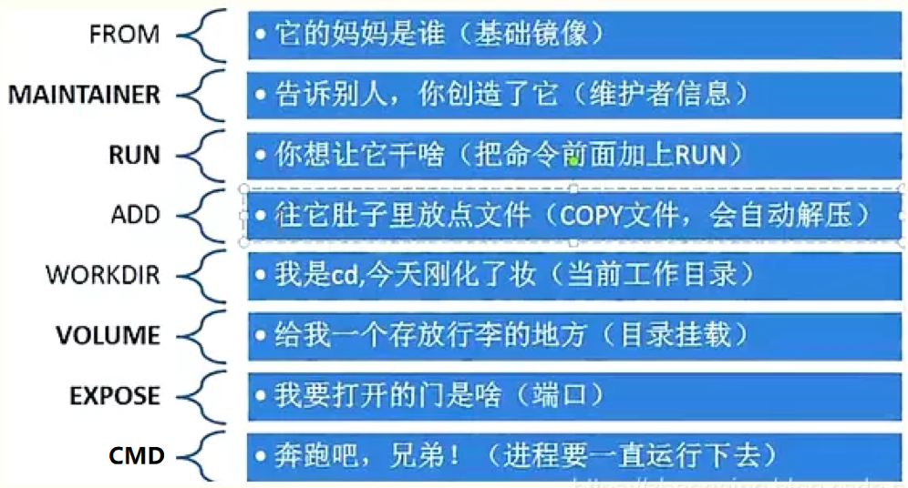

制作镜像


busybox更小，但是没有包管理器

alpine更常用

# Docker 镜像说明

## Docker 镜像说明


*   **镜像中有没有内核**

镜像为了更小和运行效率，镜像中是不包含内核的，而使用宿主机的内核

镜像本身则只提供应用所依赖的根文件系统和相关文件，即系统运行所必要的文件目录，比如: /sys,  /dev/，/proc，/bin，/etc等目录

基于内核的名称空间实现容器的各种资源隔离


*   **容器中的程序后台运行会导致此容器启动后立即退出**

当容器启动时，它会运行一个指定的初始化主程序，通常是容器的PID 1。如果这个主进程退出或停止， 容器也会相应地退出和停止。

**在Docker容器中的初始化进程可以被Dockerfile中的ENTRYPOINT或CMD指令所指明；也可以被docker  run命令的启动参数所覆盖。**

如果主进程以后台方式运行，因为容器认为主进程已经完成，它就会停止整个容器。

Docker容器如果希望启动后能持续运行,就必须有一个能前台并持续运行的进程，如果在容器中启动传统 的服务，如:httpd,php-fpm等均为后台进程模式运行,就导致 docker 在前台没有运行的应用,这样的容器 启动后会立即退出。所以一般会将服务程序以前台方式运行

**对于有一些可能不知道怎么实现前台运行的程序,只需要在启动该程序之后添加类似于 tail ，top 这种可 以前台运行的程序即可.** 

**比较常用的方法，如  tail  -f  /etc/hosts 。**

## Docker 镜像生命周期


## 制作镜像方式

Docker 镜像制作类似于虚拟机的镜像（模版）制作，即按照公司的实际业务需求将需要安装的软件、相 关配置等基础环境配置完成，然后将其做成镜像，最后再批量从镜像批量生成容器实例，这样可以极大 的简化相同环境的部署工作.

**Docker的镜像制作分为手动制作（基于容器）和自动制作(基于DockerFile)，企业通常都是基于 Dockerfile制作镜像**

```shell
docker commit #通过修改现有容器,将之手动构建为镜像
docker build  #通过Dockerfile文件,批量构建为镜像
docker import 容器tar文件  REPOSITORY[:TAG] #从tar文件生成镜像,tar文件可以通过docker export 容器 -o tar文件
```

# 将现有容器通过 docker commit 手动构建镜像

## 基于容器手动制作镜像步骤

```shell
docker commit [OPTIONS] CONTAINER [REPOSITORY[:TAG]]
-a, --author string
-c, --change list     Apply Dockerfile instruction to the created image
-m, --message string  Commit message
-p, --pause           Pause container during commit (default true)

#制作镜像和CONTAINER状态无关,停止状态也可以制作镜像
#如果没有指定[REPOSITORY[:TAG]],REPOSITORY和TAG都为<none>
#提交的时候标记TAG号:  生产当中常用，后期可以根据TAG标记创建不同版本的镜像以及创建不同版本的容器
```

基于容器手动制作镜像步骤具体如下:  

1.   下载一个系统的官方基础镜像，如:  CentOS 或 Ubuntu
2.   基于基础镜像启动一个容器,并进入到容器 
3.   在容器里面做配置操作
     *   安装基础命令
     *   配置运行环境
     *   安装服务和配置服务
     *   放业务程序代码
4.   提交为一个新镜像  `docker commit`
5.   基于自己的的镜像创建容器并测试访问

## 基于 busybox 制作 httpd 镜像

```shell
root@loong:~# docker run -it --name b1 busybox:unstable-uclibc 
/ # mkdir /data/html -p
/ # echo httpd website in busybox > /data/html/index.html
/ # exit

# 格式1
docker commit -a "loong" -c 'CMD /bin/httpd -fv -h /data/html' -c "EXPOSE 80" b1 httpd-busybox:v1.0
# 格式2
docker commit -a "loong" -c 'CMD ["/bin/httpd", "-f", "-v","-h", "/data/html"]' -c "EXPOSE 80" b1 httpd-busybox:v1.0

root@loong:~# docker images
REPOSITORY      TAG                      IMAGE ID       CREATED          SIZE
httpd-busybox   v1.0                     3b892247a42c   10 seconds ago   1.23MB

# 测试
root@loong:~# docker run  -d -P --name httpd01 httpd-busybox:v1.0
da6a3cb7047f3640d8a30aca0999eb6e8caadd215c09f64ef7869a145f1a754c
root@loong:~# docker port httpd01
80/tcp -> 0.0.0.0:32771
80/tcp -> [::]:32771
root@loong:~# docker inspect -f "{{.Config.Cmd}}" httpd01
[/bin/httpd -f -v -h /data/html]
root@loong:~# docker inspect -f "{{.NetworkSettings.Networks.bridge.IPAddress}}" httpd01
172.17.0.2
root@loong:~# curl 172.17.0.2
httpd website in busybox
root@loong:~# docker exec -it httpd01 sh
/ # pstree -p
httpd(1)
/ # ps aux
PID   USER     TIME  COMMAND
    1 root      0:00 /bin/httpd -f -v -h /data/html
    9 root      0:00 sh
   16 root      0:00 ps aux
```

## 基于官方镜像生成的容器制作 tomcat 镜像

```shell
root@loong:~# docker run -d -p 8080:8080 --name to tomcat
7ebd6203a0b2828977c97447fcd872b0eec1a4adb91eaf957d968b05c41a304d
root@loong:~# curl -I 127.0.0.1:8080
HTTP/1.1 404 

# 修改容器
root@loong:~# docker exec -it to bash
root@7ebd6203a0b2:/usr/local/tomcat# ls
bin           conf             filtered-KEYS  LICENSE  native-jni-lib  README.md      RUNNING.txt  upstream-KEYS  webapps.dist
BUILDING.txt  CONTRIBUTING.md  lib            logs     NOTICE          RELEASE-NOTES  temp         webapps        work
root@7ebd6203a0b2:/usr/local/tomcat# ls webapps.dist/
docs  examples  host-manager  manager  ROOT
root@7ebd6203a0b2:/usr/local/tomcat# ls webapps
root@7ebd6203a0b2:/usr/local/tomcat# cp -a webapps.dist/* webapps/
root@7ebd6203a0b2:/usr/local/tomcat# exit

root@loong:~# curl -I 127.0.0.1:8080
HTTP/1.1 200 
Content-Type: text/html;charset=UTF-8
Date: Sun, 16 Feb 2025 03:00:40 GMT

# 提交新镜像
root@loong:~# docker commit -m "add webapps app" -a "loong" to  tomcat:v1
sha256:3d299e221ca40b442754fd1667b7773c8e11d372ea4600348f35cf33fd7de828
root@loong:~# docker images
REPOSITORY      TAG                      IMAGE ID       CREATED          SIZE
tomcat          v1                       3d299e221ca4   7 seconds ago    516MB

root@loong:~# docker history tomcat:v1
IMAGE          CREATED          CREATED BY                                      SIZE      COMMENT
3d299e221ca4   28 seconds ago   catalina.sh run                                 5.39MB    add webapps app

# 利用新镜像启动容器
root@loong:~# docker run  -d -p 8080:8080 --name tomcat tomcat:v1
998594425df5c008f17da8d8702b3d64ad24c1ea42076a6be5dc59fa8eb4f3b7
root@loong:~# curl -I 127.0.0.1:8080
HTTP/1.1 200 
Content-Type: text/html;charset=UTF-8
Date: Sun, 16 Feb 2025 03:04:04 GMT
```

## 基于Ubuntu的基础镜像利用 apt 安装手动制作 nginx 的镜像

```shell
root@loong:~# docker run -it -p 80 --name nginx_ubuntu ubuntu:noble-20250127 bash
root@ee2b9774cdf3:/# sed -i 's/cn.archive.ubuntu.com/mirrors.ustc.edu.cn/' /etc/apt/sources.list
root@ee2b9774cdf3:/# apt update
root@ee2b9774cdf3:/# apt -y install nginx
root@ee2b9774cdf3:/# nginx -v
nginx version: nginx/1.24.0 (Ubuntu)
root@ee2b9774cdf3:/# grep include /etc/nginx/nginx.conf
include /etc/nginx/modules-enabled/*.conf;
        include /etc/nginx/mime.types;
        include /etc/nginx/conf.d/*.conf;
        include /etc/nginx/sites-enabled/*;
root@ee2b9774cdf3:/# grep root /etc/nginx/sites-enabled/default
        root /var/www/html;
root@ee2b9774cdf3:/# echo Nginx Website in Docker >  /var/www/html/index.html
root@ee2b9774cdf3:/# exit

# 提交为镜像
root@loong:~# docker commit -a 'loong' -m 'nginx-ubuntu:v1' nginx_ubuntu nginx_ubuntu:v1
sha256:932f3e1aedd8fddb93fabdf80229c75e0e7d54b90e500a8abc411c7a4b2b012d

# 从制作的新镜像启动容器并测试访问
root@loong:~# docker run -d -p 80 --name nginx-web nginx_ubuntu:v1 nginx -g 'daemon off;'
64a1e82e9206d75691dc856cf7200a5797e4a9e9769364894d9351745d13b5a4
root@loong:~# docker port nginx-web
80/tcp -> 0.0.0.0:32773
80/tcp -> [::]:32773
root@loong:~# curl http://127.0.0.1:32773
Nginx Website in Docker
```

## 基于CentOS 基础镜像手动制作编译版本 nginx 镜像

```shell
root@loong:~# docker run -it --name ce centos:centos7.9.2009 /bin/bash
[root@f727c210bd43 /]# yum -y install wget
[root@f727c210bd43 /]# rm -rf /etc/yum.repos.d/*
[root@f727c210bd43 /]# wget -P /etc/yum.repos.d/ http://mirrors.aliyun.com/repo/Centos-7.repo http://mirrors.aliyun.com/repo/epel-7.repo 

# 编译安装 nginx
[root@f727c210bd43 /]# useradd -r -s /sbin/nologin nginx
[root@f727c210bd43 /]# yum -y install gcc gcc-c++ automake pcre pcre-devel zlib zlib-devel openssl openssl-devel

[root@18855bc477e7 /]# cd /usr/local/src
[root@18855bc477e7 src]# wget http://nginx.org/download/nginx-1.16.1.tar.gz
[root@18855bc477e7 src]# tar xf nginx-1.16.1.tar.gz
[root@18855bc477e7 src]# cd nginx-1.16.1
[root@18855bc477e7 nginx-1.16.1]# ./configure  --prefix=/apps/nginx
[root@18855bc477e7 nginx-1.16.1]# make && make install
[root@18855bc477e7 nginx-1.16.1]# cd ..
[root@18855bc477e7 src]# rm -rf nginx*
[root@18855bc477e7 src]# rm -rf /var/cache/yum/*

# 关闭 nginx 后台运行
[root@18855bc477e7 src]# cd /apps/nginx/
[root@18855bc477e7 nginx]# vi conf/nginx.conf
user nginx;
daemon off;
[root@18855bc477e7 nginx]# ln -s /apps/nginx/sbin/nginx  /usr/sbin/
[root@18855bc477e7 nginx]# echo "Nginx Test Page in Docker" > /apps/nginx/html/index.html
[root@18855bc477e7 nginx]# exit

# 提交为镜像
root@loong:~# docker commit -m "nginx1.6.1"  -c "CMD nginx" ce centos7-nginx:1.6.1
root@loong:~# docker images
REPOSITORY      TAG                      IMAGE ID       CREATED          SIZE
centos7-nginx   1.6.1                    3f69e7b70cd1   5 seconds ago    380MB

# 启动容器
root@loong:~# docker run -d -p 80:80 centos7-nginx:1.6.1 nginx
root@loong:~# curl 127.0.0.1
Nginx Test Page in Docker
```

# 利用 DockerFile 文件执行 docker build 自动构建镜像


DockerFile 是一种被Docker程序解释执行的脚本，由一条条的命令组成的，每条命令对应linux下面的 一条命令，Docker程序将这些DockerFile指令再翻译成真正的linux命令，其有自己的书写方式和支持的 命令，Docker程序读取DockerFile并根据指令生成Docker镜像，相比手动制作镜像的方式，DockerFile 更能直观的展示镜像是怎么产生的，有了DockerFile，当后期有额外的需求时，只要在之前的 DockerFile添加或者修改响应的命令即可重新生成新的Docker镜像，避免了重复手动制作镜像的麻烦,类 似与shell脚本一样,可以方便高效的制作镜像

Docker守护程序 Dockerfile 逐一运行指令，如有必要，将每个指令的结果提交到新镜像，然后最终输 出新镜像的ID。

Docker守护程序将自动清理之前发送的上下文

请注意，每条指令都是独立运行的，并会导致创建新镜像比如`RUN cd /tmp`对下一条指令不会有任何影响。

Docker将尽可能重用中间镜像层（缓存），以显著加速 docker build 命令的执行过程，这由`Usingc ache `控制台输出中的消息指示

## Dockerfile 镜像制作和使用流程


## Dockerfile文件的制作镜像的分层结构


## Dockerfile 文件格式

Dockerfile 是一个有特定语法格式的文本文件

[Dockerfile reference | Docker Docs](https://docs.docker.com/reference/dockerfile/)

**Dockerfile 文件说明**

*   每一行以Dockerfile的指令开头，指令不区分大小写，但是惯例使用大写
*   使用 # 开始作为注释
*   每一行只支持一条指令，每条指令可以携带多个参数
*   指令按文件的顺序从上至下进行执行
*   每个指令的执行会生成一个新的镜像层，为了减少分层和镜像大小，尽可能将多条指令合并成一条 指令
*   制作镜像一般可能需要反复多次，每次执行dockfile都按顺序执行，从头开始，已经执行过的指令 已经缓存，不需要再执行，如果后续有一行新的指令没执行过，其往后的指令将会重新执行，所以 为加速镜像制作，将最常变化的内容放下dockerfile的文件的后面

## Dockerfile 相关指令

| 指令          | 描述                               |
| ------------- | ---------------------------------- |
| `ADD`         | 添加本地或远程文件和目录。         |
| `ARG`         | 使用构建时变量。                   |
| `CMD`         | 指定默认命令。                     |
| `COPY`        | 复制文件和目录。                   |
| `ENTRYPOINT`  | 指定默认可执行文件。               |
| `ENV`         | 设置环境变量。                     |
| `EXPOSE`      | 描述应用程序监听的端口。           |
| `FROM`        | 从基础镜像创建新的构建阶段。       |
| `HEALTHCHECK` | 在启动时检查容器的健康状况。       |
| `LABEL`       | 为镜像添加元数据。                 |
| `MAINTAINER`  | 指定镜像的作者。                   |
| `ONBUILD`     | 指定当该镜像用于构建时执行的指令。 |
| `RUN`         | 执行构建命令。                     |
| `SHELL`       | 设置镜像的默认Shell。              |
| `STOPSIGNAL`  | 指定容器退出时的系统调用信号。     |
| `USER`        | 设置用户和组ID。                   |
| `VOLUME`      | 创建卷挂载。                       |
| `WORKDIR`     | 更改工作目录。                     |

```shell
# dockerfile 文件中的有18个指令,但最常见指令:
 FROM
 LABEL
 RUN
 ADD
 COPY
 CMD
 ENTRYPOINT
 ENV
 EXPOSE
 USER
 VOLUME
 WORKDIR
```



### FROM: 指定基础镜像

定制镜像，需要先有一个基础镜像，在这个基础镜像上进行定制。

FROM 就是指定基础镜像，此指令通常必需放在Dockerfile文件第一个非注释行。后续的指令都是运行 于此基准镜像所提供的运行环境

基础镜像可以是任何可用镜像文件，默认情况下，docker build会在docker主机上查找指定的镜像文 件，在其不存在时，则会从Docker Hub Registry上拉取所需的镜像文件.如果找不到指定的镜像文件， docker build会返回一个错误信息

对于不同的软件官方都提供了相关的docker镜像，比如:  nginx、redis、mysql、httpd、tomcat等服务 类的镜像，也有操作系统类，如:  centos、ubuntu、debian等。建议使用官方镜像，比较安全。

```shell
FROM [--platform=<platform>] <image> [AS <name>]
FROM [--platform=<platform>] <image>[:<tag>] [AS <name>]
FROM [--platform=<platform>] <image>[@<digest>] [AS <name>]

# --platform 指定镜像的平台，比如:  linux/amd64, linux/arm64, or windows/amd64
# tag 和 digest是可选项，如果不指定，默认为latest
```

**关于scratch 镜像**

```shell
FROM scratch
# 该镜像是一个空的镜像，可以用于构建busybox等超小镜像，可以说是真正的从零开始构建属于自己的镜像
# 该镜像在构建基础镜像（例如debian和busybox）或超最小镜像（仅包含一个二进制文件及其所需内容，例如:hello-world）的上下文中最有用。
```

```shell
FROM scratch       #所有镜像的起源镜像，相当于JAVA中Object类
FROM ubuntu:bionic
FROM ubuntu:bionic
FROM debian:buster-slim
```

### LABEL: 指定镜像元数据

可以指定镜像元数据，如:  镜像作者等

```shell
LABEL <key>=<value> [<key>=<value>...]

LABEL "com.example.vendor"="ACME Incorporated"
LABEL com.example.label-with-value="foo"
LABEL version="1.0"
LABEL description="This text illustrates \
that label-values can span multiple lines."

# 一个镜像可以有多个label ,还可以写在一行中,即多标签写法,可以减少镜像的层数
LABEL multi.label1="value1" multi.label2="value2" other="value3"
LABEL multi.label1="value1" \
      multi.label2="value2" \
      other="value3"
```

docker inspect 命令可以查看LABEL

```shell
docker image inspect --format='{{json .Config.Labels}}' myimage
```

### MAINTAINER: 指定维护者信息

此指令已过时，用LABEL代替

```
MAINTAINER <name>
```

### RUN: 执行 shell 命令

RUN 指令用来在构建镜像阶段需要执行 FROM 指定镜像所支持的Shell命令

注意:  RUN 可以写多个，每一个RUN指令都会建立一个镜像层，所以尽可能合并成一条指令,比如将多个 shell命令通过 && 连接一起成为在一条指令

每个RUN都是独立运行的,和前一个RUN无关

```shell
# Shell form: 相当于 /bin/sh -c  <命令>  此种形式支持环境变量
RUN [OPTIONS] <command> ...

# 如果想使用其它shell,可以用SHELL指令指定不同的shell
SHELL ["/bin/bash", "-c"]
RUN [OPTIONS] <command> ...

# Exec form: 此种形式不支持环境变量,注意:是双引号,不能是单引号
RUN [OPTIONS] [ "<command>", ... ]

# exec格式可以指定其它shell
RUN ["/bin/bash","-c","echo hello"]
```

shell格式中，\<command\>通常是一个shell命令，且以"/bin/sh -c”来运行它，这意味着此进程在容器中 的PID不为1，**不能接收Unix信号**，**因此，当使用docker stop 命令停止容器时，此进程接收 不到SIGTERM信号**

exec格式中的参数是一个JSON格式的数组，其中\<executable\>为要运行的命令，后面的为\<paramN\>传递 给命令的选项或参数;然而，此种格式指定的命令不会以"/bin/sh -c"来发起，因此常**见的shell操作如变 量替换以及通配符(?,*等)替换将不会进行**;不过，如果要运行的命令依赖于此shell特性的话，可以将其替 为类似下面的格式。

`RUN ["/bin/bash", "-c", "<executable>", "<param1>"]`

**关于 shell 和 exec 形式**

*   Shell解释：
    *   Shell形式：命令通过Shell解释，这意味着可以使用Shell特性，例如环境变量替换、管道和重 定向。
    *   Exec形式：命令直接执行，不经过Shell。因此，没有Shell特性支持。
*   可移植性和安全性：
    *   Shell形式：由于依赖Shell解释，可能会受到Shell注入攻击或其他Shell相关的问题。
    *   Exec形式：更安全和可移植，因为命令直接执行，不依赖Shell。
*   性能：
    *   Shell形式：需要额外启动一个Shell进程，可能略有性能开销。 
    *   Exec形式：直接执行命令，通常更高效。
*   复杂命令：
    *   Shell形式：适合编写复杂的命令或使用Shell特性的场景。 
    *   Exec形式：适合简单的命令或不需要Shell功能的场景。

```dockerfile
FROM registry.cn-beijing.aliyuncs.com/wangxiaochun/alpine:3.20.0
LABEL maintainer="wangxiaochun<root@wangxiaochun.com>"
RUN sed -i 's@dl-cdn.alpinelinux.org@mirrors.tuna.tsinghua.edu.cn@'  
/etc/apk/repositories
RUN apk add bash
RUN echo {1..10} > a.txt
RUN ["bash","-c","echo {1..10} > b.txt"]

# a.txt {1..10} sh 是默认的 shell，而 sh 不支持类似 {1..10} 的扩展语法
# b.txt 1 2 3 4 5 6 7 8 9 10
```

调整时区

```dockerfile
FROM alpine:3.19.1
RUN sed -i 's/dl-cdn.alpinelinux.org/mirrors.tuna.tsinghua.edu.cn/' /etc/apk/repositories &&   apk update &&  apk  --no-cache add curl bash tzdata  && ln -s  /usr/share/zoneinfo/Asia/Shanghai /etc/localtime
```

多个 前后RUN 命令独立无关和shell命令不同

```dockerfile
#world.txt并不存放在/app内
RUN cd /app
RUN echo "hello" > world.txt
 
#下面写法可以实现关联关系
RUN cd /app &&  echo "hello" > world.txt
```

### ENV: 设置环境变量

ENV 可以定义环境变量和值，会被后续指令(如:ENV,ADD,COPY,RUN等)通过$KEY或${KEY}进行引用， 并在容器运行时保持

```dockerfile
ENV <key>=<value> [<key>=<value>...]
#如果<value>中包含空格，可以以反斜线\进行转义，也可通过对<value>加引号进行标识;另外，反斜线也可用于续行

#只使用一次变量
RUN <key>=<value> <command>

#引用变量
RUN $key .....
```

如果运行容器时如果需要修改变量,可以执行下面通过基于 exec 机制实现

注意: 下面方式只影响容器运行时环境,而不影响构建镜像的过程,即只能覆盖docker run时的环境变量,而 不会影响docker build时环境变量的值

```shell
docker run -e|--env <key>=<value>
```

范例

```dockerfile
ENV VERSION=1.0 DEBUG=on NAME="Happy Feet"
ENV PG_MAJOR 9.3
ENV PG_VERSION 9.3.4
RUN curl -SL http://example.com/postgres-$PG_VERSION.tar.xz | tar -xJC 
/usr/src/postgress && …
ENV PATH /usr/local/postgres-$PG_MAJOR/bin:$PATH
```

范例

```dockerfile
FROM busybox
LABEL maintainer="l"
ENV NAME l l n
RUN touch $NAME.txt

# 构建
docker build -t test:v1 .

# 测试
docker run  --rm  --name c1 test:v1 env
docker run  --rm -e NAME=mage --name c1 test:v1 env
```

### COPY: 复制文本

```shell
COPY [OPTIONS] [--chown=<user>:<group>] <src> ... <dest>
COPY [OPTIONS] [--chown=<user>:<group>] ["<src>", ... "<dest>"]
#路径中有空白字符时,建议使用第二种格式
```

*   \<src>可以是多个,可以使用通配符，通配符规则满足Go的filepath.Match 规则

    filepath.Match 参考链接:  https://golang.org/pkg/path/filepath/#Match

*   \<src>必须是build上下文中的相对路径(为 Dockerfile 所在目录的相对路径），不**能是其父目录中的文 件**

*   如果\<src>是目录，则其内部文件或子目录会被递归复制，**但\<src>目录自身不会被复制**

*   如果指定了多个\<src>, 或在\<src>中使用了通配符，则\<dest>必须是一个目 录，**且必须以 / 结尾**

*   \<dest>可以是绝对路径或者是 WORKDIR 指定的相对路径

*   \<dest>使用 COPY 指令，源文件的各种元数据都会保留。比如读、写、执行权限、文件变更时间等

*   如果\<dest>事先不存在，它将会被自动创建，这包括其父目录路径,即递归创建目录

```dockerfile
COPY file1.txt file2.txt /usr/src/things/
COPY *.png /dest/
COPY index.?s /dest/

# create /abs/test.txt
COPY test.txt /abs/

WORKDIR /usr/src/app
# create /usr/src/app/rel/test.txt
COPY test.txt rel/
```

### ADD: 复制和解包文件

```shell
ADD [OPTIONS] <src> ... <dest>
ADD [OPTIONS] ["<src>", ... "<dest>"]
```

该命令可认为是增强版的COPY，不仅支持COPY，还支持自动解压缩。可以将复制指定的  到容器中

但请注意，`COPY` 不支持通过 URL 添加文件。

*   可以是Dockerfile所在目录的一个相对路径；也可是一个 URL；还可是一个 tar 文件（自动解压）
*   可以是绝对路径或者是 WORKDIR 指定的相对路径
*   如果是目录，只复制目录中的内容，而非目录本身
*   如果是一个 URL ，下载后的文件权限自动设置为 600 
*   如果为URL且dest不以/结尾，则指定的文件将被下载并目标路径将成为从URL下载的文件的文件名,如果dest以 / 结尾，则文件名URL指定 的文件将被直接下载并保存为/< filename>

```dockerfile
ADD test relativeDir/          # adds "test" to `WORKDIR`/relativeDir/
ADD test /absoluteDir/         # adds "test" to /absoluteDir/
ADD --chown=55:mygroup files* /somedir/
ADD ubuntu-xenial-core-cloudimg-amd64-root.tar.gz /
```

### CMD: 容器启动命令


一个容器中通常需要一个持续运行的业务主进程

CMD 用来指定启动容器时默认执行的一个初始命令

如果容器内没有一个持续运行的前台进程,容器会停止

所以一般CMD 指定的命令为持续运行且为前台命令,如果有多个命令,需要保证有一个命令是前台并持续 运行的

*   如果docker run没有指定任何的执行命令或者dockerfile里面也没有ENTRYPOINT命令，那么开启 容器时就会使用执行CMD指定的默认的命令
*   RUN 命令是在构建镜像时执行的命令
*   每个 Dockerfile 只能有一条 CMD 命令。如指定了多条，只有最后一条被执行
*   如果用户启动容器时用 docker run xxx 指定运行的命令，则会覆盖 CMD 指定的命令

```shell
# 使用exec形式，推荐方式，第一个参数必须是命令的全路径,此种形式不支持环境变量,注意:是双引号,不能是单引号
CMD ["executable","param1","param2"] 

# shell形式,默认/bin/sh 中执行，提供给需要交互的应用；此种形式支持环境变量,相当于执行 /bin/sh -c "command param1 param2"
CMD command param1 param2 

#指定不同的shell
SHELL ["/bin/bash", "-c"]
CMD command param1 param2

CMD ["/bin/bash", "-c","executable","param1","param2"]

# 使用exec形式,提供给 ENTRYPOINT 命令的充当其参数
CMD ["param1","param2"]
```

范例

```dockerfile
CMD ["nginx", "-g", "daemon off;"]
CMD ["/apps/nginx/sbin/nginx", "-g","daemon off;"]
```


### ENTRYPOINT: 入口点


```dockerfile
ENTRYPOINT ["executable", "param1", "param2"]
ENTRYPOINT command param1 param2
```

*    **ENTRYPOINT 不能被 docker run 提供的参数覆盖，而是追加,即如果docker run 命令有参数，那 么参数全部都会作为ENTRYPOINT的参数**

*   如果docker run 后面没有额外参数，但是dockerfile中有CMD命令（即上面CMD的第三种用 法），即Dockerfile中即有CMD也有ENTRYPOINT,那么CMD的全部内容会作为ENTRYPOINT的参 数
*   如果docker run 后面有额外参数，同时Dockerfile中即有CMD也有ENTRYPOINT,那么docker run 后面的参数覆盖掉CMD参数内容,最终作为ENTRYPOINT的参数
*   可以通过docker run --entrypoint string 参数在运行时替换,注意string不要加空格
*   使用CMD要在运行时重新写命令本身,然后在后面才能追加运行参数，ENTRYPOINT则可以运行时 无需重写命令就可以直接接受新参数
*   每个 Dockerfile 中只能有一个 ENTRYPOINT，当指定多个时，只有最后一个生效
*   通常ENTRYPOINT指令配合脚本,主要用于为CMD指令提供环境配置

```dockerfile
FROM centos:centos7.9-v10.0
LABEL maintainer="wangxiaochun <root@wangxiaochun.com>" 
ENV version=1.18.0
ADD nginx-$version.tar.gz /usr/local/
RUN cd /usr/local/nginx-$version && ./configure --prefix=/apps/nginx && make && 
make install && rm -rf /usr/local/nginx* && sed -i 's/.*nobody.*/user nginx;/'  
/apps/nginx/conf/nginx.conf && useradd -r nginx
COPY index.html /apps/nginx/html
VOLUME ["/apps/nginx/html"]
EXPOSE 80 443
CMD ["-g","daemon off;"]
ENTRYPOINT ["/apps/nginx/sbin/nginx"]
#上面两条指令相当于ENTRYPOINT ["/apps/nginx/sbin/nginx","-g","daemon off;"]
HEALTHCHECK --interval=5s --timeout=3s CMD curl -fs http://127.0.0.1/
```

利用脚本实现指定环境变量动态生成配置文件内容

```dockerfile
FROM nginx:1.16-alpine
ENV DOC_ROOT='/data/website/'
ADD index.html ${DOC_ROOT}
ADD entrypoint.sh /bin/
EXPOSE 80/tcp 8080
# 运行命令
CMD ["/usr/sbin/nginx","-g", "daemon off;"] 
# 环境初始化
ENTRYPOINT [ "/bin/entrypoint.sh"]
#CMD指令的内容都成为了ENTRYPOINT的参数
```


```shell
# entrypoint.sh

#!/bin/sh
#注意：alpine镜像没有bash，此处使用sh
cat > /etc/nginx/conf.d/www.conf <<EOF
 server {
    server_name ${HOSTNAME:-"www.a.com"};
    listen ${IP:-0.0.0.0}:${PORT:-80};
    root   ${DOC_ROOT:-/usr/share/nginx/html};
}
EOF
# exec后面的命令会替换当前的shell，继承shell的pid
exec "$@"

chmod +x entrypoint.sh
docker build -t nginx:v1.0 . 
docker run --name n1 --rm -P -e "PORT=8080" -e "HOSTNAME=www.wang.org" nginx:v1.0
```


### SHELL: 指定 Shell 类型

```shell
SHELL ["executable", "parameters"]
# Linux 上的默认 shell 是 ["/bin/sh", "-c"] 
#Windows 上的默认 shell 是["cmd", "/S", "/C"]
```

### ARG: 构建参数

ARG指令在build 阶段指定变量

和ENV不同的是，容器运行时并不存在ARG定义的环境变量

```shell
ARG <name>[=<default value>]
```

范例: 指定构建变量

```dockerfile
FROM openjdk:8-jdk-alpine
ARG JAR_FILE
COPY ${JAR_FILE} app.jar
EXPOSE 8000
ENTRYPOINT["java","-jar","/app.jar"]

docker build --build-arg JAR_FILE=myapp1.jar -t myapp1:v1.0 .
```

FROM指令支持ARG指令放在第一个FROM之前声明变量

```dockerfile
ARG  CODE_VERSION=latest
FROM base:${CODE_VERSION}

#在FROM之前声明的ARG在构建阶段之外，所以它不能在FROM之后的任何指令中使用。 要使用在第一个FROM之前声明的ARG的默认值，请在构建阶段内使用没有值的ARG指令
ARG VERSION=latest
FROM busybox:$VERSION
ARG VERSION=latest
RUN echo $VERSION > image_version
```

### VOLUME: 匿名卷

在容器中创建一个可以从本地主机或其他容器挂载的挂载点，一般用来存放数据库和需要保持的数据 等，默认会将宿主机上的目录挂载至VOLUME 指令指定的容器目录。即使容器后期被删除，此宿主机的 目录仍会保留，从而实现容器数据的持久保存。

```shell
VOLUME <容器内路径>
VOLUME ["<容器内路径1>", "<容器内路径2>"...]

# <容器内路径>如果在容器内不存在,在创建容器时会自动创建
# <容器内路径>如果是存在的,同时目录内有内容,将会把此目录的内容复制到宿主机的实际目录

# docker rm -fv <容器ID> 可以删除容器的同时删除VOLUME指定的卷
```

范例:

```
FROM alpine:3.11 
LABEL maintainer="wangxiaochun <root@wangxiaochun.com>"
COPY repositories /etc/apk/repositories 
VOLUME [ "/testdata","/testdata2" ]
```

```shell
# 会持久化在宿主机的var/lib/docker/volumes/下，文件名随机
ls /var/lib/docker/volumes/
```

### EXPOSE: 暴露端口

指定服务端的容器需要对外暴露(监听)的端口号，以实现容器与外部通信。

EXPOSE 仅仅是声明容器打算使用什么端口而已,并不会真正暴露端口,即不会自动在宿主进行端口映射

注意: 即使 Dockerfile 没有 EXPOSE 端口指令,也可以通过docker run -p  临时暴露容器内程序真正监 听的端口,所以EXPOSE 相当于指定默认的暴露端口,可以通过docker run -P 进行真正暴露

```dockerfile
EXPOSE 80 443
EXPOSE 11211/udp 11211/tcp
```

### WORKDIR: 指定工作目录

为后续的 RUN、CMD、ENTRYPOINT 指令配置工作目录，当容器运行后，进入容器内WORKDIR指定的 默认目录

WORKDIR 指定工作目录（或称当前目录），以后各层的当前目录就被改为指定的目录，如该目录不存 在，WORKDIR 会自行创建

```dockerfile
WORKDIR /a
WORKDIR b
WORKDIR c
RUN pwd

#则最终路径为 /a/b/c
```

### ONBUILD: 子镜像引用父镜像的指令

可以用来配置当构建当前镜像的子镜像时，会自动触发执行的指令,但在当前镜像构建时,并不会执行,即 延迟到子镜像构建时才执行

```shell
ONBUILD [INSTRUCTION]
```

Dockerfile 使用如下的内容创建了镜像 image-A。

```shell
ONBUILD ADD http://www.wang.com/wp-content/uploads/2017/09/logo.png /data/
ONBUILD RUN rm -rf /*
ONBUILD RUN /usr/local/bin/python-build --dir /app/src...
```

如果基于 image-A 创建新的镜像image-B时，新的Dockerfile中使用 FROM image-A指定基础镜像时， 会自动执行ONBUILD 指令内容，等价于在后面添加了两条指令。

```dockerfile
FROM image-A
#Automatically run the following
ADD http://www.wang.com/wp-content/uploads/2017/09/logo.png /data
RUN /usr/local/bin/python-build --dir /app/src
```

*   尽管任何指令都可注册成为触发器指令，但ONBUILD不能自我能套，且不会触发FROM和 MAINTAINER指令
*   使用 ONBUILD 指令的镜像，推荐在标签中注明，例如  ruby:1.9-onbuild

### USER: 指定当前用户

```dockerfile
RUN groupadd -r mysql && useradd -r -g mysql mysql
USER mysql
```

### HEALTHCHECK: 健康检查

```dockerfile
HEALTHCHECK --interval=5s --timeout=3s CMD curl -fs http://localhost/

docker ps 
#如果健康性检查成功,STATUS会显示 (healthy) 
#如果健康性检查不通过,STATUS会显示(unhealthy)
```

### STOPSIGNAL: 退出容器的信号

该STOPSIGNAL指令设置将被发送到容器退出的系统调用信号。它指定在docker stop 停止容器时发送 给主进程的信号。

默认情况下，Docker 在停止容器时会发送  SIGTERM 信号来终止容器中的主进程，但你可以通过  STOPSIGNAL 指令来更改这个行为。

```dockerfile
STOPSIGNAL SIGQUIT
# 运行 docker stop 时，Docker 会发送 SIGQUIT 信号，而不是默认的SIGTERM 信号
```


###  .dockerignore文件

与.gitignore文件类似，生成构建上下文时Docker客户端应忽略的文件和文件夹指定模式

```shell
#排除 test 目录下的所有文件
test/*
#排除 md 目录下的 xttblog.md 文件
md/xttblog.md
#排除 xttblog 目录下的所有 .md 的文件
xttblog/*.md
#排除以 xttblog 为前缀的文件和文件夹
xttblog?
#排除所有目录下的 .sql 文件夹
**/*.sql 
```


## Dockerfile 构建过程和指令总结


###  构建镜像docker build 命令

```shell
docker build [OPTIONS] PATH | URL | -
PATH | URL | -     
# 可以使是本地路径，也可以是URL路径。若设置为 - ，则从标准输入获取Dockerfile的内容
-f, --file string  #Dockerfile文件名,默认为 PATH/Dockerfile
--force-rm         # 总是删除中间层容器,创建镜像失败时，删除临时容器
--no-cache         #不使用之前构建中创建的缓存
-t --tag list      # 设置注册名称、镜像名称、标签。格式为 <注册名称>/<镜像名称>:<标签>（标签默认为latest）
-q  --quiet=false
--rm=true          # 创建镜像成功时，删除临时容器
```

```shell
docker build .
docker build /usr/local/src/nginx
docker build -f /path/to/a/Dockerfile .
docker build -t shykes/myapp .
docker build -t shykes/myapp:1.0.2 -t shykes/myapp:latest .
docker build -t test/myapp .
docker build -t nginx:v1 /usr/local/src/nginx
```

查看镜像的构建历史

```shell
docker history 镜像ID
```

### 从镜像导出对应的 Dockerfile

```shell
alias whaler="docker run -t --rm -v /var/run/docker.sock:/var/run/docker.sock:ropegleg/whaler"

whaler alpine:3.15
```

# 利用 DockerFile 自动构建镜像案例

## 基于 Alpine 基础镜像制作 Nginx 源码编译镜像

```
wget http://nginx.org/download/nginx-1.16.1.tar.gz
```

nginx.conf

```shell
user nginx;
daemon off;

worker_processes  1;

events {
    worker_connections  1024;
}


http {
    include       mime.types;
    default_type  application/octet-stream;

    sendfile        on;
    keepalive_timeout  65;

    server {
        listen       80;
        server_name  localhost;

        location / {
            root   /data/nginx/html;
            index  index.html index.htm;
        }

        error_page   500 502 503 504  /50x.html;
        location = /50x.html {
            root   /data/nginx/html;
        }
    }

}
```


```dockerfile
ARG VERSION=3.11
FROM alpine:$VERSION 

RUN sed -i 's/dl-cdn.alpinelinux.org/mirrors.ustc.edu.cn/' /etc/apk/repositories && \
    apk update && apk --no-cache add tzdata gcc make curl zip unzip net-tools pstree wget libgcc libc-dev libcurl libc-utils pcre-dev zlib-dev  libnfs  pcre pcre2 libevent libevent-dev iproute2 && \
    ln -s  /usr/share/zoneinfo/Asia/Shanghai /etc/localtime && \
    echo "Asia/Shanghai" > /etc/timezone
    
ENV NGINX_VERSION=1.16.1 NGINX_DIR=/apps/nginx
ADD nginx-${NGINX_VERSION}.tar.gz /usr/local/src

RUN cd /usr/local/src/nginx-$NGINX_VERSION && \
    ./configure  --prefix=${NGINX_DIR} && make && make install && \
    ln -s $NGINX_VERSION/sbin/nginx  /usr/local/sbin/ && \
    addgroup  -g 888 -S nginx && adduser  -s /sbin/nologin -S -D  -u 888 -G nginx nginx && \
    chown  -R  nginx.nginx  /data/nginx/ ${NGINX_DIR}/
    
    
COPY nginx.conf ${NGINX_DIR}/conf/nginx.conf 
ADD index.html ${NGINX_DIR}/html/index.html

EXPOSE 80 443
CMD ["nginx"] 
```


## 多阶段构建

```docker
#第一次构建，执行编译等，用于生成必要的程序
FROM <image> [AS <name>]

#第二次构建
FROM <image>
COPY --from=<name>] src dest
COPY --from=0  src dest
```

### 基于传统方式构建Golang应用

hello.go

```go
package main
import (
  "fmt"
  "time"
)
func main() {
  for {
     fmt.Println("hello,world!")
     time.Sleep(time.Second)
  }
}
```

Dockerfile

```dockerfile
FROM ubuntu:jammy

COPY hello.go /opt/

WORKDIR /opt
RUN apt update && apt -y  install golang  &&  go build hello.go
CMD ["/opt/hello"]
```

方法2

```dockerfile
FROM golang:1.18-alpine

COPY hello.go /opt
WORKDIR /opt
RUN go build hello.go
CMD ["/opt/hello"]
```

多阶段构建Golang应用

```dockerfile
FROM golang:1.18-alpine as builder
COPY hello.go /opt
WORKDIR /opt
RUN go build hello.go 

FROM alpine:3.15.0
#FROM scratch
COPY --from=builder /opt/hello /hello
#COPY --from=0 /opt/hello /hello
CMD ["/hello"]
```

### 多阶段构建实现基于Alpine的Nginx的编译安装

```shell
wget http://nginx.org/download/nginx-1.24.0.tar.gz
```


```shell
user nginx;

worker_processes  1;

events {
    worker_connections  1024;
}


http {
    include       mime.types;
    default_type  application/octet-stream;

    sendfile        on;
    keepalive_timeout  65;

    server {
        listen       80;
        server_name  localhost;

        location / {
            root   html;
            index  index.html index.htm;
        }

        error_page   500 502 503 504  /50x.html;
        location = /50x.html {
            root   html;
        }
    }

}
```


```dockerfile
ARG VERSION=3.18.0
FROM alpine:$VERSION

ENV NGINX_VERSION=1.24.0 NGINX_DIR=/apps/nginx

ADD http://nginx.org/download/nginx-1.24.0.tar.gz /usr/local/src/

RUN  sed -i 's/dl-cdn.alpinelinux.org/mirrors.ustc.edu.cn/' /etc/apk/repositories  && \
     apk update && \
     apk --no-cache add gcc make libgcc libc-dev libcurl libc-utils pcre-dev zlib-dev libnfs pcre pcre2  net-tools curl pstree wget libevent libevent-dev iproute2 openssl-dev && \
     cd /usr/local/src/nginx-$NGINX_VERSION && \
     ./configure  --prefix=${NGINX_DIR} --user=nginx --group=nginx --with-http_ssl_module --with-http_v2_module --with-http_realip_module --with-http_stub_status_module --with-http_gzip_static_module --with-pcre --with-stream --with-stream_ssl_module --with-stream_realip_module && \
     make && make install && \
     rm -rf /usr/local/src/nginx-$NGINX_VERSION
     
COPY nginx.conf ${NGINX_DIR}/conf/nginx.conf

FROM alpine:$VERSION

ENV NGINX_DIR=/apps/nginx

COPY --from=0 ${NGINX_DIR}/ ${NGINX_DIR}/

RUN  sed -i 's/dl-cdn.alpinelinux.org/mirrors.ustc.edu.cn/' /etc/apk/repositories && \
     apk update && apk --no-cache add tzdata curl pcre pcre2 && \
     ln -s  /usr/share/zoneinfo/Asia/Shanghai /etc/localtime && \
     ln -sf ${NGINX_DIR}/sbin/nginx  /usr/sbin/nginx && \
     addgroup -g 888 -S nginx && \
     adduser  -u 888 -G nginx -D -S -s /sbin/nologin nginx && \
     chown  -R  nginx.nginx  ${NGINX_DIR}/ && \
     ln -sf /dev/stdout ${NGINX_DIR}/logs/access.log && \
     ln -sf /dev/stderr ${NGINX_DIR}/logs/error.log
     
EXPOSE 80 443
CMD ["nginx","-g","daemon off;"]
```

```shell
docker build -t nginx-alpine3.18:1.24.0-v1 .

docker run -d -p 80:80 nginx-alpine3.18:1.24.0-v1
```


