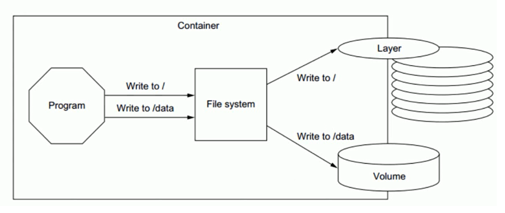
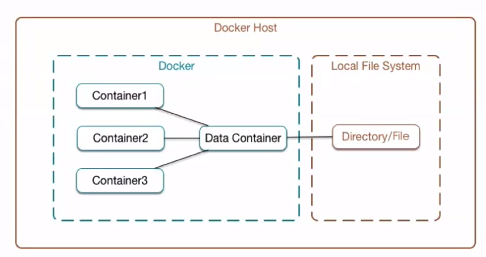
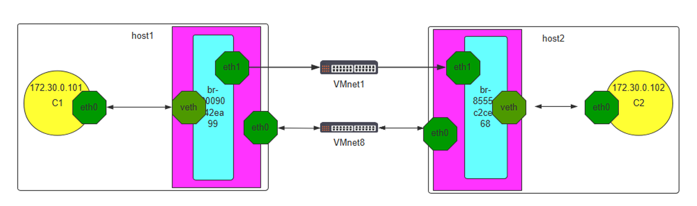

# Docker 数据管理


Docker镜像由多个只读层叠加而成，启动容器时，Docker会加载只读镜像层并在镜像栈顶部添加一个读 写层

如果运行中的容器修改了现有的一个已经存在的文件，那该文件将会从读写层下面的只读层复制到读写 层，该文件的只读版本仍然存在，只是已经被读写层中该文件的副本所隐藏，此即“写时复制(COW copy  on write)"机制

如果将正在运行中的容器修改生成了新的数据，那么新产生的数据将会被复制到读写层，进行持久化保 存，这个读写层也就是容器的工作目录，也为写时复制(COW) 机制。

COW机制节约空间,但会导致性低下,虽然关闭重启容器,数据不受影响,但会随着容器的删除,其对应的可写 层也会随之而删除,即数据也会丢失.如果容器需要持久保存数据,并不影响性能可以用数据卷技术实现

如下图是将对根的数据写入到了容器的可写层，但是把/data 中的数据写入到了一个另外的volume 中 用于数据持久化



## 容器的数据管理介绍

Docker镜像是分层设计的，镜像层是只读的，通过镜像启动的容器添加了一层可读写的文件系统，用户 写入的数据都保存在这一层中。

### Docker容器的分层

容器的数据分层目录

*   LowerDir:  image 镜像层,即镜像本身，只读
*   UpperDir:  容器的上层,可读写 ,容器变化的数据存放在此处
*   MergedDir:  容器的文件系统，使用Union FS（联合文件系统）将lowerdir 和 upperdir 合并完成 后给容器使用,最终呈现给用户的统一视图
*   WorkDir:  容器在宿主机的工作目录,挂载后内容会被清空，且在使用过程中其内容用户不可见


### 哪些数据需要持久化


## 容器数据持久保存方式

*   绑定挂载（Bind Mount）

    这种方式可以将指定的宿主机上的任意文件或目录挂载到容器内。与卷不同，绑定挂载依赖于宿主 机的文件系统结构。

    另外，由于绑定挂载可以访问宿主机上的任意文件和目录，使用这种方式可能会有一定的安全风 险。

*   卷（Volume）

    这是 Docker 推荐的挂载方式。卷是完全由 Docker 管理的文件目录，可以在容器之间共享和重 用。在创建卷时，Docker 创建了一个目录在宿主机上，然后将这个目录挂载到容器内。卷的主要 优点是你可以使用 Docker CLI 或 Docker API 来备份、迁移或者恢复卷，而无需关心卷在宿主机上 的具体位置。

    卷分为匿名卷和命名卷

*   tmpfs 挂载

    此方式并不算一种持久化方案

    tmpfs 挂载不与宿主机上的任何文件或目录相关联，而是将一个**内存空间的临时文件系统挂载到容 器的某个目录下。**

    这种方式的主要优点是它提供了一个高速且安全的挂载方式，因为 tmpfs 挂载通常驻留在宿主机的 内存中，且在容器停止后会被自动删除。

    tmpfs 挂载是临时的，只存留在容器宿主机的内存中。**当容器停止时，tmpfs 挂载文件路径将被删 除，在那里写入的文件不会被持久化。**

 Docker的卷（Volume）类型分为两种: 

*   数据卷(Data Volume):  直接将宿主机目录挂载至容器的指定的目录 ，推荐使用此种方式，此方式 较常用
    *   指定宿主机目录或文件: 指定宿主机的具体路径和容器路径的挂载关系，此方式不会创建数据卷
    *   匿名卷:  不指定数据名称,只指定容器内目录路径充当挂载点,docker自动指定宿主机的路径进行挂 载，此方式会创建匿名数据卷,Dockerfile中VOLUME指定的卷即为此种
    *   命名卷:  指定数据卷的名称和容器路径的挂载关系，此方式会创建命名数据卷
*   数据卷容器(Data Volume Container):  间接使用宿主机空间，数据卷容器是将宿主机的目录挂载至 一个专门的数据卷容器，然后让其他容器通过数据卷容器读写宿主机的数据 ，此方式不常用

数据卷容器(Data Volume Container):  间接使用宿主机空间，数据卷容器是将宿主机的目录挂载至 一个专门的数据卷容器，然后让其他容器通过数据卷容器读写宿主机的数据 ，此方式不常用

### tmpfs 

```shell
docker run -d --tmpfs /data --name test pod-test:v0.1
```

### 数据卷使用方法

```shell
docker run -v, --volume=[host-src:]container-dest[:<options>]

ro 从容器内对此数据卷是只读，不写此项默认为可读可写
rw 从容器内对此数据卷可读可写,此为默认值
host-src 宿主机目录如果不存在,会自动创建
container-dest 容器目录如果不存在,会自动创建
```

#### 绑定挂载

```shell
docker run -d  -p 80:80 --name nginx01 -v /data/nginx:/usr/share/nginx/html  nginx

# :前是路径，当前文件夹下文件也要写成./
```

#### 匿名卷

而匿名卷则是随着容器建立而建立，随着容器消亡而淹没于卷列表中（对于 docker run 匿名卷不会被自动 删除）。 因此匿名卷只存放无关紧要的临时数据，随着容器消亡，这些数据将失去存在的意义。

```shell
docker run --name nginx -v /etc/nginx nginx

# 在/var/lib/docker/volumes/下
```

#### 命名卷

有名字的卷，在用过一次后，以后挂载容器的时候还可以使用，因为有名字可以指定。所以一般需要保存的数 据使用命名卷保存。

```shell
docker volume  create vol1  #也可以事先不创建
docker run -d  -p 80:80 --name nginx01 -v vol1:/usr/share/nginx/html  nginx

# :前是卷名
# 在/var/lib/docker/volumes/下

docker run -d  --name mysql -p 3306:3306 -v /data/mysql/:/var/lib/mysql -e MYSQL_ROOT_PASSWORD=123456 mysql:8.0.29-oracle
```

## 管理数据卷命令

```shell
docker volume COMMAND

# 查看数据卷的挂载关系
docker inspect --format="{{.Mounts}}"  <容器ID>

# 删除所有数据卷
docker volume rm `docker volume ls -q`

# 创建命名卷并删除
docker volume create mysql-vol
docker volume ls
tree /var/lib/docker/volumes/
docker volume rm mysql-vol 
docker volume ls

# 删除不再使用的数据卷
docker volume prune  -f

```

## 数据卷容器

**数据卷容器的功能只是将数据挂载信息传递给了其它使用数据卷容器的容器,而数据卷容器本 身并不提供数据存储功能**



在Dockerfile中创建的是匿名数据卷,无法直接实现多个容器之间共享数据

**数据卷容器主要的功能是可以让数据在多个docker容器之间共享**

如下图所示: 即可以让B容器和C容器都可以访问A容器的内容，即可以实现A，B，C 三个容器之间的数据 读写共享。


相当于先要创建一个后台运行的容器作为 Server，用于提供数据卷，这个卷可以为其他容器提供数据存 储服务，其他使用此卷的容器作为client端 ，但此方法并不常使用

缺点:  因为依赖一个 Server  的容器，所以此 Server 容器出了问题，其它 Client容器都会受影响

```shell
docker run --volumes-from <数据卷容器>

# 数据卷服务器
docker run -d --name volume-server -v /data/bin/catalina.sh:/apps/tomcat/bin/catalina.sh:ro -v /data/testapp:/data/tomcat/webapps/testapp   tomcat-web:app1

# 数据卷客户端
docker run -d --name client1 --volumes-from volume-server -p 8081:8080  tomcat-web:app1
docker run -d --name client2 --volumes-from volume-server -p 8082:8080  tomcat-web:app1

# 关闭卷容器Server，仍然可以创建新的client容器及访问旧的client容器
docker stop volume-server

# 删除数据卷容器后，旧的client 容器仍能访问，但无法再创建新的client容器
# 删除数据卷容器后，旧的client 容器仍能访问，但无法再创建基于数据卷容器的新的client容器,但可以创建基于已创建的Client容器的Client容器
docker rm -fv volume-server

```

**利用数据卷容器备份指定容器的数据卷实现**

由于匿名数据卷在宿主机中的存储位置不确定,所以为了方便的**备份匿名数据卷**,可以利用数据卷容器实现 数据卷的备份

```shell
# 备份
docker run -it --rm --volumes-from [container name] -v $(pwd):/backup ubuntu

[container name]            #表示需要备份的匿名数据卷的容器
[container data volume]     #表示容器内的需要备份的匿名数据卷对应的目录

# 还原
docker run -it --rm --volumes-from [container name] -v $(pwd):/backup ubuntu


# 此容器需要备份匿名卷
# 容器内的/datavolume1需要备份
docker run -it -v /datavolume1  --name volume-server centos bash

# 备份
# 此容器中有前面容器的匿名卷与自己的绑定挂载
docker run -it --rm --volumes-from volume-server -v ~/backup:/backup --name backup-server ubuntu
# 容器中，进入匿名卷挂载目录，将其中数据归档至绑定挂载，到宿主机的本地
cd /datavolume1/
tar cvf /backup/data.tar .
exit

#删除容器的数据
docker start -i volume-server
rm -rf /datavolume1/*
exit

# 还原
# 将宿主机的本地备份还原至匿名卷挂载目录
docker run --rm --volumes-from volume-server -v ~/backup:/backup --name backup-server ubuntu tar xvf /backup/data.tar -C /datavolume1/
```

利用数据卷容器备份MySQL数据库

```shell
# MySQL容器默认使用了匿名卷
docker run -d  --name mysql -p 3306:3306 -e MYSQL_ROOT_PASSWORD=123456  mysql:5.7.30

# 备份
docker run -it --rm --volumes-from mysql  -v $(pwd):/backup centos tar xvf  /backup/mysql.tar -C  /var/lib/mysql

# 还原
docker run -it --rm --volumes-from mysql  -v $(pwd):/backup centos tar xvf  /backup/mysql.tar -C  /
```

# Docker 网络管理

[Networking | Docker Docs](https://docs.docker.com/engine/network/)

## Docker安装后默认的网络设置

Docker服务安装完成之后，默认在每个宿主机会生成一个名称为docker0的网卡其IP地址都是 172.17.0.1/16

veth（Virtual Ethernet）是Linux内核中的一种虚拟网络设备，通常用于连接两个网络命名空间。

veth 设备总是成对出现，当在一个网络命名空间中创建veth设备时，会同时创建两个端点。veth设备的两个 端点可以被看作是一个虚拟的以太网电缆，任何发送到其中一个端点的数据包都会被立即从另一个端点 传出。以下是veth设备的一些主要特性：

*   命名空间间通信：veth设备主要用于连接不同的网络命名空间，允许它们之间进行通信。这使得在 一个隔离的环境中运行的进程可以与外部世界交互，而不会影响到其它网络命名空间。
*   成对出现：veth设备总是成对创建的，形成一个虚拟的双向通道。当数据包发送到一个端点时，它 会从另一个端点出来。因此，你可以把veth设备看作是一个虚拟的以太网电缆。
*   灵活性：veth设备的两个端点可以分别位于不同的网络命名空间中，甚至可以在同一命名空间中。 这为设置复杂的网络拓扑提供了很大的灵活性。
*    和其他网络设备相互操作：veth设备可以和Linux的其他网络设备（如bridge、veth pair、 physical NIC等）一起使用，创建复杂的网络配置。

每一个Docker容器都有自己的网络 命名空间，Docker使用veth设备连接容器的网络命名空间和主机的网络命名空间，使得容器可以和外部 网络进行通信。

每次新建容器后

*   宿主机多了一个虚拟网卡vethxxxxx，和容器的网卡组合成一个网卡，比如:  137:  veth8ca6d43@if136，而在容器内的网卡名为136，可以看出和宿主机的网卡之间的关联
*   容器会自动获取一个172.17.0.0/16网段的随机地址，默认从172.17.0.2开始，第二次容器为 172.17.0.3，以此类推
*   容器获取的地址并不固定,每次容器重启,可能会发生地址变化

```shell
# 添加俩网络命名空间
ip netns add c1-net
ip netns add c2-net

# 创建eth1的虚拟网卡与eth2配对
ip link add eth1 type veth peer eth2
# 给网络命名空间设网卡
ip link set eth1 netns c1-net
ip link set eth2 netns c2-net
# 分配ip
ip netns exec c1-net ip a a 1.1.1.1/24 dev eth1
ip netns exec c2-net ip a a 1.1.1.2/24 dev eth2
# 启动网卡
ip netns exec c1-net ip link set eth1 up
ip netns exec c2-net ip link set eth2 up
# 测试
ip netns exec c1-net ping -c1  1.1.1.2

# 无法ping通自身，因为lo没启动
ip netns exec c1-net ping 1.1.1.1
# lo启动
ip netns exec c1-net ip link set lo up
ip netns exec c1-net ping 1.1.1.1
```

veth 桥接

```shell
#创建网桥
ip link add br0 type bridge

#创建虚拟网卡对veth
ip link add veth1 type veth peer veth1-eth0

#veth桥接
ip link set veth1-eth0 master br0

#查看桥接
ip link show master br0
```

### 修改默认docker0网桥的网络配置

默认docker后会自动生成一个docker0的网桥,使用的IP是172.17.0.1/16,可能和宿主机的网段发生冲突, 可以将其修改为其它网段的地址,避免冲突

将docker0的IP修改为指定IP

```shell
vim /etc/docker/daemon.json 

{
  "bip": "192.168.100.1/24"
}

# 方法2
vim /lib/systemd/system/docker.service
ExecStart=/usr/bin/dockerd -H fd:// --containerd=/run/containerd/containerd.sock --bip=192.168.100.1/24

# 注意两种方法不可混用,否则将无法启动docker服务
```

### 修改默认网络设置使用自定义网桥

新建容器默认使用docker0的网络配置,可以修改默认指向自定义的网桥网络

```shell
apt -y install bridge-utils
brctl addbr br0
ip a a 192.168.100.1/24 dev br0

vim /lib/systemd/system/docker.service
xecStart=/usr/bin/dockerd -H fd:// --containerd=/run/containerd/containerd.sock -b br0
```


## 创建容器后的网络状态

```shell
docker run -it --rm  alpine:3.11 sh
/ # ip a
/ # cat /etc/hosts
```

新建一个容器，在宿主机的会生成一个新网卡，和容器成对儿的出现

```shell
apt -y install bridge-utils
brctl show

#查看网卡的类型
ethtool -i eth0

# 查看容器网卡和宿主机网卡的对应关系
ethtool -S eth0

# 查看新建容器后桥接状态
brctl show
```

## 容器间的通信

默认情况下

*   同一个宿主机的不同容器之间可以相互通信

    ```shell
    dockerd   --icc
    --icc=false  #此配置可以禁止同一个宿主机的容器之间通信
    ```

*   不同宿主机之间的容器IP地址重复，默认不能相互通信

    要通信需要不同网段

    改iptales规则

    加路由

    实现繁琐

    一般是通过k8s实现

    k8s也是通过网络插件实现

### 通过容器名称互联

注意: 如果被引用的容器地址变化,必须重启当前容器才能生效

```shell
docker run --link list <目标通信的容器ID或容器名称>

# 将目标容器的容器名与IP加入到了host文件中
# 以此实现通过容器名称通讯
# 自己的host文件中IP对应没有自己的容器名
```

### 通过自定义容器别名互联

自定义的容器名称可能后期会发生变化，那么一旦名称发生变化，容器内程序之间也必须要随之发生变 化，比如:程序通过固定的容器名称进行服务调用，但是容器名称发生变化之后再使用之前的名称肯定是 无法成功调用，每次都进行更改的话又比较麻烦，因此可以使用自定义别名的方式解决，即容器名称可 以随意更改，只要不更改别名即可

```shell
docker run --name <容器名称> --link <目标容器名称>:"<容器别名1>  <容器别名2> ..."
```

## Docker 网络连接模式

Docker 的网络支持 5 种网络模式: 

*   none 
*   host 
*   bridge 
*   container 
*   network-name

```shell
# 默认的网络模式有三个
docker network ls
NETWORK ID     NAME                   DRIVER    SCOPE
94a56a1f2469   bridge                 bridge    local
a64d053551b4   host                   host      local
489d6e0c6c18   none                   null      local

docker run --network <mode>
docker run --net=<mode>
#<mode>:  可是以下值
#none
#bridge
#host
#container:<容器名或容器ID>
#<自定义网络名称>
```

### Bridge网络模式

本模式是docker的默认模式，即不指定任何模式就是bridge模式，也是使用比较多的模式，此模式创建 的容器会为每一个容器分配自己的网络 IP 等信息，并将容器连接到一个虚拟网桥与外界通信

**可以和外部网络之间进行通信，通过SNAT访问外网，使用DNAT可以让容器被外部主机访问，所以此模 式也称为NAT模式**

**此模式宿主机需要启动ip_forward功能**

*   外部主机无法直接访问容器:  可以通过配置DNAT接受外网的访问

*   低性能较低:  因为可通过NAT，网络转换带来更的损耗 

*   端口管理繁琐:  每个容器必须手动指定唯一的端口，容器产生端口冲容


```shell
# 查看bridge模式信息
docker network inspect bridge

# 安装docker后.默认启用ip_forward
cat /proc/sys/net/ipv4/ip_forward

iptables -vnL -t nat

# 修改Bridge网络配置方法
vim /etc/docker/daemon.json 

{
  "bip": "192.168.100.1/24"
}

# 方法2
vim /lib/systemd/system/docker.service
ExecStart=/usr/bin/dockerd -H fd:// --containerd=/run/containerd/containerd.sock --bip=192.168.100.1/24

# 注意两种方法不可混用,否则将无法启动docker服务
docker network inspect bridge
```

### Host 模式

如果指定host模式启动的容器，那么新创建的容器不会创建自己的虚拟网卡，而是直接使用宿主机的网 卡和IP地址，因此在容器里面查看到的IP信息就是宿主机的信息，访问容器的时候直接使用宿主机IP+容 器端口即可，不过容器内除网络以外的其它资源，如:  文件系统、系统进程等仍然和宿主机保持隔离

此模式由于直接使用宿主机的网络无需转换，网络性能最高，但是各容器内使用的端口不能相同，适用 于运行容器端口比较固定的业务

*   **不支持端口映射**
*   容易产生端口冲突
*   网络资源无法分别统计


```shell
docker run -d --network host --name web1 nginx-centos7-base:1.6.1

# 容器内网络与宿主机网络相同
# 在host 模式下不支持 --link
```

### None 模式

在使用 none 模式后，Docker 容器不会进行任何网络配置，没有网卡、没有IP也没有路由，因此默认无 法与外界通信，需要手动添加网卡配置IP等，所以极少使用

```shell
docker run --network none
```

### Container 模式

使用此模式创建的容器需指定和一个已经存在的容器共享一个网络，而不是和宿主机共享网络，新创建 的容器不会创建自己的网卡也不会配置自己的IP，而是和一个被指定的已经存在的容器共享IP和端口范 围，因此这个容器的端口不能和被指定容器的端口冲突，除了网络之外的文件系统、进程信息等仍然保 持相互隔离，两个容器的进程可以通过lo网卡进行通信

*   空器间共享网络空间,直接使用对方的网络
*   第一个容器的网络可能是bridge，或none，或者host，而第二个容器模式依赖于第一个容器，它 们共享网络
*   如果第一个容器停止，将导致无法创建第二个容器
*   第二个容器可以直接使用127.0.0.1访问第一个容器
*   适合频繁的容器间的网络通信
*   默认不支持端口映射，较少使用


```shell
docker run --network container:wordpress
```

### 自定义网络模式

可以使用自定义网络模式,实现不同集群应用的独立网络管理,而互不影响,而且在网一个网络内,可以直接 利用容器名相互访问，非常便利

注意: 自定义网络内的容器可以直接通过容器名进行相互的访问,而无需使用 --link

```shell
docker network create -d <mode> --subnet <CIDR> --gateway <网关> <自定义网络名称>

#注意mode不支持host和none,默认是bridge模式
-d <mode> 可省略，默认为bridge,支持bridge,overlay，macvlan等driver模式

docker run --network  <自定义网络名称> <镜像名称>
docker run --net  <自定义网络名称> --ip <指定静态IP> <镜像名称>
docker run --network  <自定义网络名称> --network-alias list  <镜像名称>

docker network ls

docker network rm <自定义网络名称或网络ID>
# 内置的三个网络无法删除

```

创建自定义的网络

```shell
docker  network create -d bridge --subnet 172.27.0.0/16 --gateway 172.27.0.1 test-net
docker inspect test-net

docker run -it --rm --network test-net alpine sh
docker inspect test-net

# 自定义网络中的容器之间可以直接利用容器名进行通信
docker run -it --rm --network test-net --name test1  alpine
docker run -it --rm --network test-net --name test2  alpine

# ping通
ping -c1 test1
```

```shell
for port in {1..6};do \
    docker run -p 637${port}:6379 -p 1667${port}:16379 --name redis-${port} \
    -v /data/redis/node-${port}/data:/data \
    -v /data/redis/node-${port}/conf/redis.conf:/etc/redis/redis.conf \
    -d --net net-redis --ip 172.18.0.1${port} redis:5.0.9-alpine3.11 redis-server /etc/redis/redis.conf
done

# 6个redis容器

# 进入容器，创建集群
docker exec -it redis-1 /bin/sh
redis-cli -a 123456 --cluster create 172.18.0.11:6379 172.18.0.12:6379 172.18.0.13:6379 172.18.0.14:6379 172.18.0.15:6379 172.18.0.16:6379 --cluster-replicas 1
```

**docker network connect 实现同一个宿主机不同网 络的容器间通信**

```shell
docker network connect [OPTIONS] NETWORK CONTAINER
docker network disconnect [OPTIONS] NETWORK CONTAINER

# test1是bridge网桥（自定义网络） test2是test-net网桥（自定义网络）
# 将test1容器连通到test-net网桥上
docker network connect test-net test1

#在test1容器中可以看到新添加了一个网卡,并且分配了test-net网络的IP信息
#test1可以连接test-net的test2容器
#test2不可以连接test1容器，但可以ping test的新网卡

# 原理就是test1多了张对面网桥的网卡

# 将自定义网络中的容器test2也加入到默认网络中,使之和默认网络中的容器test1通信
docker network connect bridge test2


docker network  disconnect test-net test1
docker network  disconnect bridge test2
```

## 实现跨宿主机的容器之间网络互联

### 利用桥接实现跨宿主机的同一网段二层网络的容器间互联



```shell
#第一个主机
docker network create mynet --subnet 172.30.0.0/16
docker run -it --network mynet  --ip 172.30.0.101  --name c1 alpine:3.20.0
#在此主机添加一个新网卡仅主机模式的eth1, 并将eth1接到网桥
brctl addif br-80090f42ea99 eth1
ip link set eth1 up

#第二个主机
docker network create mynet --subnet 172.30.0.0/16
docker run -it --network mynet  --ip 172.30.0.102  --name c1 alpine:3.20.0
#在此主机添加一个新网卡仅主机模式的eth1, 并将eth1接到网桥
brctl addif br-8555ec2cee68 eth1
ip link set eth1 up

# 容器到网桥，到仅主机，到对面仅主机，到对面网桥，到对面容器
```

### 利用NAT实现跨主机的不同网段三层网络的容器间互联


跨主机互联是说A宿主机的容器可以访问B主机上的容器，但是前提是保证各宿主机之间的网络是可以相 互通信的，然后各容器才可以通过宿主机访问到对方的容器

实现原理:  是在宿主机做一个网络路由就可以实现A宿主机的容器访问B主机的容器的目的

**注意:  此方式只适合小型网络环境，复杂的网络或者大型的网络可以使用其它网络插件比如： Google 开 源的 Kubernetes 网络插件Flannel和Calico 进行互联**

```shell
# 宿主机A 10.0.0.2
/etc/docker/daemon.json
{
 "bip": "172.27.0.1/24",
}
# 启动容器
docker run -it --name server1 --rm  alpine sh
# 添加静态路由和iptables规则
route add -net 172.37.0.1/24 gw 10.0.0.3
iptables -A FORWARD -s 10.0.0.0/24 -j ACCEPT # iptables -P FORWARD ACCEPT

# 宿主机B 10.0.0.3
/etc/docker/daemon.json
{
 "bip": "172.37.0.1/24",
}
# 启动容器
docker run -it --name server2 --rm  alpine sh
# 添加静态路由和iptables规则
route add -net 172.27.0.1/24 gw 10.0.0.2
iptables -A FORWARD -s 10.0.0.0/24 -j ACCEPT # iptables -P FORWARD ACCEPT
```

# Docker Compose 容器单机编排


当在宿主机启动较多的容器时候，如果仍用手动执行docker run 启动每个容器不仅很麻烦而且因为有依 赖关系等导致容易出错，而且无法不方便分类管理

可以使用 docker 单机多容器的编排工具 docker-compose 解决

docker-compose 项目是Docker 官方的开源项目，负责实现对Docker 容器集群的快速编排，可以用它 同时管理多个容器

比如:  可以解决容器之间的依赖关系，就像启动一个nginx 前端服务的时候会调用后端的 tomcat，那就 得先启动tomcat，但是启动tomcat 容器还需要依赖MySQL数据库，那就还得先启动MySQL，docker compose 可以用来解决这样的嵌套依赖关系，并且可以替代docker命令对容器进行创建、启动和停止 等手工的操作

[Docker Compose | Docker Docs](https://docs.docker.com/compose/)

## 安装和准备

### 包安装

```shell
# 之前装docker-ce是一块装了
# Add Docker's official GPG key:
sudo apt-get update
sudo apt-get install ca-certificates curl
sudo install -m 0755 -d /etc/apt/keyrings
sudo curl -fsSL https://download.docker.com/linux/ubuntu/gpg -o /etc/apt/keyrings/docker.asc
sudo chmod a+r /etc/apt/keyrings/docker.asc

# Add the repository to Apt sources:
echo \
  "deb [arch=$(dpkg --print-architecture) signed-by=/etc/apt/keyrings/docker.asc] https://download.docker.com/linux/ubuntu \
  $(. /etc/os-release && echo "${UBUNTU_CODENAME:-$VERSION_CODENAME}") stable" | \
  sudo tee /etc/apt/sources.list.d/docker.list > /dev/null
sudo apt-get update

# docker-compose-plugin
sudo apt-get install docker-ce docker-ce-cli containerd.io docker-buildx-plugin docker-compose-plugin

docker compose version
```

### 在线直接从包仓库安装

此方法安装的版本较旧，不推荐使用

```shell
apt list  docker-compose

apt -y install docker-compose
```

### 离线安装，直接从github或国内镜像站下载安装对应版本

[Releases · docker/compose](https://github.com/docker/compose/releases)

```
wget https://github.com/docker/compose/releases/download/v2.33.0/docker-compose-linux-x86_64 -o /usr/local/bin/docker-compose

chmod +x /usr/local/bin/docker-compose
```

### 在线通过 pip安装

python-pip 包将安装一个 pip 的命令，pip 命令是一个python 安装包的安装工具，其类似于ubuntu 的 apt 或者 redhat 的yum，但是pip 只安装 python 相关的安装包，可以在多种操作系统安装和使用pip

此方式当前安装的版本较新，推荐使用

```shell
apt  install -y  python-pip 

yum install epel-release
yum install -y python-pip
pip install --upgrade pip

mkdir ~/.pip
cat > ~/.pip/pip.conf <<-EOF
[global]
index-url = https://pypi.tuna.tsinghua.edu.cn/simple
EOF

apt -y install python3-pip
pip3 install --upgrade pip
pip3 install docker-compose
docker-compose --version
```


## 命令格式

```shell
docker-compose --help

-f，–file FILE #指定Compose 模板文件，默认为docker-compose.yml|yaml
-p，–project-name NAME #指定项目名称，默认将使用当前所在目录名称作为项目名。

#以下为命令选项，需要在docker-compose.yml|yaml 文件所在在目录里执行 
docker-compose config  -q #查看当前配置，没有错误不输出任何信息
docker-compose up #创建并启动容器
build  #构建镜像
bundle #从当前docker compose 文件生成一个以<当前目录>为名称的json格式的Docker Bundle 备份文件
create #创建服务
down #停止和删除所有容器、网络、镜像和卷
events #从容器接收实时事件，可以指定json 日志格式
exec #进入指定容器进行操作 
images #显示镜像信息
kill #强制终止运行中的容器
logs #查看容器的日志 
pause #暂停服务 
port #查看端口 
ps #列出容器
pull #重新拉取镜像，镜像发生变化后，需要重新拉取镜像
push #上传镜像 
restart #重启服务
rm #删除已经停止的服务 
run #一次性运行容器 
scale  #设置指定服务运行的容器个数，新版已废弃
start #启动服务
stop #停止服务
top #显示容器运行状态 
unpause #取消暂定
```

```shell
#默认查找当前目录的文件 docker-compose.yml, docker-compose.yaml, compose.yml, compose.yaml
docker-compose  ls
docker-compose ps
```

## docker compose 文件格式

docker compose 文件是一个yaml格式的文件，所以注意行首的缩进很严格

[Compose file reference | Docker Docs](https://docs.docker.com/reference/compose-file/)

默认docker-compose命令会调用当前目录下的docker-compose.yml的文件，因此一般执行docker-compose命令前先进入docker-compose.yml文件所在目录

## 从 docker compose 启动单个容器

```yaml
docker-compose.yml
service-nginx-web:
  image: nginx-centos7-base:1.6.1
  container_name: nginx-web
  expose:- 80 - 443
  ports:- "80:80"- "443:443"

# 前台启动
docker-compose up
# 查看compose容器
docker-compose ps

docker-compose images

docker-compose exec nginx-web bash

docker-compose start

docker-compose kill

docker-compose rm

# 后台启动
docker-compose up -d
#停止容器
docker-compose down
# 日志事件
docker-compose events
# 暂停
docker-compose  pause
# 恢复
docker-compose  unpause
# 同时启动多个容器 
#同时启动多个同一镜像的容器，不要指定容器名称，否则会冲突 
#同时启动多个同一镜像的容器，不要指定端口号，否则会冲突
docker-compose  up -d --scale service-nginx-web=2
```

##  从 docker compose 启动多个容器

harbor的docker-compose.yml文件

```yaml
services:
  log:
    image: goharbor/harbor-log:v2.12.2
    container_name: harbor-log
    restart: always
    cap_drop:
      - ALL
    cap_add:
      - CHOWN
      - DAC_OVERRIDE
      - SETGID
      - SETUID
    volumes:
      - /var/log/harbor/:/var/log/docker/:z
      - type: bind
        source: ./common/config/log/logrotate.conf
        target: /etc/logrotate.d/logrotate.conf
      - type: bind
        source: ./common/config/log/rsyslog_docker.conf
        target: /etc/rsyslog.d/rsyslog_docker.conf
    ports:
      - 127.0.0.1:1514:10514
    networks:
      - harbor
      
  registry:
    image: goharbor/registry-photon:v2.12.2
    container_name: registry
    restart: always
    cap_drop:
      - ALL
    cap_add:
      - CHOWN
      - SETGID
      - SETUID
    volumes:
      - /data/registry:/storage:z
      - ./common/config/registry/:/etc/registry/:z
      - type: bind
        source: /data/secret/registry/root.crt
        target: /etc/registry/root.crt
      - type: bind
        source: ./common/config/shared/trust-certificates
        target: /harbor_cust_cert
    networks:
      - harbor
    depends_on:
      - log
    logging:
      driver: "syslog"
      options:
        syslog-address: "tcp://localhost:1514"
        tag: "registry"
        
  registryctl:
    image: goharbor/harbor-registryctl:v2.12.2
    container_name: registryctl
    env_file:
      - ./common/config/registryctl/env
    restart: always
    cap_drop:
      - ALL
    cap_add:
      - CHOWN
      - SETGID
      - SETUID
    volumes:
      - /data/registry:/storage:z
      - ./common/config/registry/:/etc/registry/:z
      - type: bind
        source: ./common/config/registryctl/config.yml
        target: /etc/registryctl/config.yml
      - type: bind
        source: ./common/config/shared/trust-certificates
        target: /harbor_cust_cert
    networks:
      - harbor
    depends_on:
      - log
    logging:
      driver: "syslog"
      options:
        syslog-address: "tcp://localhost:1514"
        tag: "registryctl"
        
  postgresql:
    image: goharbor/harbor-db:v2.12.2
    container_name: harbor-db
    restart: always
    cap_drop:
      - ALL
    cap_add:
      - CHOWN
      - DAC_OVERRIDE
      - SETGID
      - SETUID
    volumes:
      - /data/database:/var/lib/postgresql/data:z
    networks:
      harbor:
    env_file:
      - ./common/config/db/env
    depends_on:
      - log
    logging:
      driver: "syslog"
      options:
        syslog-address: "tcp://localhost:1514"
        tag: "postgresql"
    shm_size: '1gb'
    
  core:
    image: goharbor/harbor-core:v2.12.2
    container_name: harbor-core
    env_file:
      - ./common/config/core/env
    restart: always
    cap_drop:
      - ALL
    cap_add:
      - SETGID
      - SETUID
    volumes:
      - /data/ca_download/:/etc/core/ca/:z
      - /data/:/data/:z
      - ./common/config/core/certificates/:/etc/core/certificates/:z
      - type: bind
        source: ./common/config/core/app.conf
        target: /etc/core/app.conf
      - type: bind
        source: /data/secret/core/private_key.pem
        target: /etc/core/private_key.pem
      - type: bind
        source: /data/secret/keys/secretkey
        target: /etc/core/key
      - type: bind
        source: ./common/config/shared/trust-certificates
        target: /harbor_cust_cert
    networks:
      harbor:
    depends_on:
      - log
      - registry
      - redis
      - postgresql
    logging:
      driver: "syslog"
      options:
        syslog-address: "tcp://localhost:1514"
        tag: "core"
        
  portal:
    image: goharbor/harbor-portal:v2.12.2
    container_name: harbor-portal
    restart: always
    cap_drop:
      - ALL
    cap_add:
      - CHOWN
      - SETGID
      - SETUID
      - NET_BIND_SERVICE
    volumes:
      - type: bind
        source: ./common/config/portal/nginx.conf
        target: /etc/nginx/nginx.conf
    networks:
      - harbor
    depends_on:
      - log
    logging:
      driver: "syslog"
      options:
        syslog-address: "tcp://localhost:1514"
        tag: "portal"

  jobservice:
    image: goharbor/harbor-jobservice:v2.12.2
    container_name: harbor-jobservice
    env_file:
      - ./common/config/jobservice/env
    restart: always
    cap_drop:
      - ALL
    cap_add:
      - CHOWN
      - SETGID
      - SETUID
    volumes:
      - /data/job_logs:/var/log/jobs:z
      - type: bind
        source: ./common/config/jobservice/config.yml
        target: /etc/jobservice/config.yml
      - type: bind
        source: ./common/config/shared/trust-certificates
        target: /harbor_cust_cert
    networks:
      - harbor
    depends_on:
      - core
    logging:
      driver: "syslog"
      options:
        syslog-address: "tcp://localhost:1514"
        tag: "jobservice"
        
  redis:
    image: goharbor/redis-photon:v2.12.2
    container_name: redis
    restart: always
    cap_drop:
      - ALL
    cap_add:
      - CHOWN
      - SETGID
      - SETUID
    volumes:
      - /data/redis:/var/lib/redis
    networks:
      harbor:
    depends_on:
      - log
    logging:
      driver: "syslog"
      options:
        syslog-address: "tcp://localhost:1514"
        tag: "redis"
        
  proxy:
    image: goharbor/nginx-photon:v2.12.2
    container_name: nginx
    restart: always
    cap_drop:
      - ALL
    cap_add:
      - CHOWN
      - SETGID
      - SETUID
      - NET_BIND_SERVICE
    volumes:
      - ./common/config/nginx:/etc/nginx:z
      - type: bind
        source: ./common/config/shared/trust-certificates
        target: /harbor_cust_cert
    networks:
      - harbor
    ports:
      - 80:8080
    depends_on:
      - registry
      - core
      - portal
      - log
    logging:
      driver: "syslog"
      options:
        syslog-address: "tcp://localhost:1514"
        tag: "proxy"
        
networks:
  harbor:
    external: false
```

## 构建和部署 Tomcat

```shell
cat tomcat/Dockerfile 
FROM tomcat:jdk11
RUN cd /usr/local/tomcat/webapps.dist && mv *  /usr/local/tomcat/webapps/ 
COPY ./manager-context.xml /usr/local/tomcat/webapps/manager/META-INF/context.xml
COPY ./host-manager-context.xml /usr/local/tomcat/webapps/host-manager/META-INF/context.xml

cat docker-compose.yaml

volumes:
  tomcat_apps: {}
  
networks:
  tomcat_net:
    driver: bridge
    ipam:
      config:
        - subnet: 172.27.0.0/24
    
services:
  tomcat:
    #image: tomcat:jdk11
    image: tomcat:v1.0
    build:
      context: tomcat
      dockerfile: Dockerfile
    hostname: tomcat.wang.org
    container_name: tomcat
    ports:
      - 80:8080
    volumes:
      - tomcat_apps:/usr/local/tomcat/webapps
      - ./tomcat/tomcat-users.xml:/usr/local/tomcat/conf/tomcat-users.xml
    networks:
      tomcat_net:
        ipv4_address: 172.27.0.100
        aliases:
          - tomcat
          - apps
    environment:
      TZ: Asia/Shanghai
 restart: always
 
 docker-compose build
 
```

##  docker run 和 Docker Compose 文件相互 转换

[Composerize](https://www.composerize.com/)

[Decomposerize](https://www.decomposerize.com/)