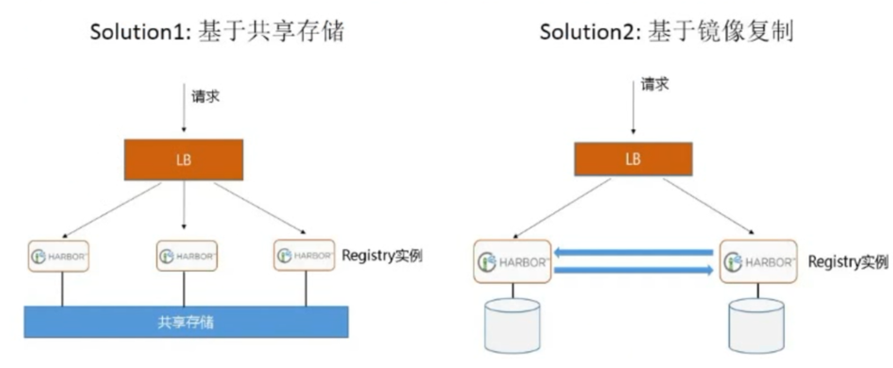

# Docker 仓库管理

Docker仓库，类似于yum仓库，是用来保存镜像的仓库。

为了方便的管理和使用docker镜像,可以将镜像集中保存至Docker仓库中，将制作好的镜像push到仓库 集中保存，在需要镜像时，从仓库中pull镜像即可。

Docker 仓库分为公有云仓库和私有云仓库

公有云仓库:  由互联网公司对外公开的仓库

*   官方 
*   阿里云等第三方仓库

私有云仓库:  组织内部搭建的仓库，一般只为组织内部使用，常使用下面软件搭建仓库

*   docker registory
*    docker harbor

## 使用docker官方用户仓库管理镜像

```shell
docker login  -u llk -pP@ssw0rd!  docker.io

#登录成功后,自动生成验证信息,下次会自动登录,而无需手动登录
cat .docker/config.json

# 上传本地镜像前必须先给上传的镜像用docker tag 命令打标签
docker tag alpine:3.18.0 l00n9/alpine:3.18.0
docker push l00n9/alpine:3.18.0

# 下载上传的镜像并创建容器
docker pull l00n9/alpine:3.18.0
```

使用组织管理镜像

组织类似于名称空间，每个组织的名称全网站唯一，一个组织可以有多个用户帐户使用，并且可以指定 不同用户对组织内的仓库不同的权限

三种不同权限

*   Read-only:  Pull and view repository details and builds
*   Read &Write:  Pull, push, and view a repository; view, cancel, retry or trigger builds
*    Admin:  Pull, push, view, edit, and delete a repository; edit build settings; update the  repository description

创建组织

docker hub自己账号的Organizations项

## 阿里云Docker仓库

```shell
docker login --username=l00n9 crpi-bnxk9w4yo3b8quy6.cn-shanghai.personal.cr.aliyuncs.com

# 上传本地镜像前必须先给上传的镜像用docker tag 命令打标签
docker tag alpine:3.18.0 crpi-bnxk9w4yo3b8quy6.cn-shanghai.personal.cr.aliyuncs.com/l00n9/alpine:3.18.0
docker push crpi-bnxk9w4yo3b8quy6.cn-shanghai.personal.cr.aliyuncs.com/l00n9/alpine:3.18.0

# 下载上传的镜像并创建容器
docker pull crpi-bnxk9w4yo3b8quy6.cn-shanghai.personal.cr.aliyuncs.com/l00n9/alpine:3.18.0
```

## 私有云单机仓库 Docker Registry

[Deprecated products and features | Docker Docs](https://docs.docker.com/retired/)

```shell
docker pull registry:2.7.1

# 创建授权用户密码使用目录
mkdir -p  /etc/docker/auth
apt -y install apache2-utils
htpasswd -Bbn wang 123456 > /etc/docker/auth/registry

docker run -d -p 5000:5000 --restart=always --name registry -v /etc/docker/auth:/auth -e "REGISTRY_AUTH=htpasswd" -e "REGISTRY_AUTH_HTPASSWD_REALM=Registry Realm" -e REGISTRY_AUTH_HTPASSWD_PATH=/auth/registry registry:2.7.1

# 加入不安全仓库
{
 "insecure-registries": ["10.0.0.12:5000"]
}

docker login 10.0.0.12:5000

docker tag centos7-base:v1 10.0.0.12:5000/centos7-base:v1
docker push 10.0.0.12:5000/centos7-base:v1

docker pull  10.0.0.12:5000/centos7-base:v1
```

## Docker 之分布式仓库 Harbor


### 单机使用

#### 安装 Harbor

[Releases · goharbor/harbor](https://github.com/goharbor/harbor/releases)

```shell
# 安装docker与docker compose

# 下载harbor安装包离线版
wget https://github.com/goharbor/harbor/releases/download/v2.7.1/harbor-offline-installer-v2.7.1.tgz

tar xvf harbor-offline-installer-v1.7.6.tgz
```

####  编辑 harbor 配置文件

[Harbor docs | Harbor 2.12 Documentation](https://goharbor.io/docs/2.12.0/)

```shell
cp harbor/harbor.yml.tmpl harbor/harbor.yml

vim /usr/local/harbor/harbor.yml
hostname = 10.0.0.101          
#修改此行,指向当前主机IP 或 FQDN,建议配置IP
harbor_admin_password = 123456
data_volume: /data/harbor      
#建议修改数据目录路径，使用大容量的高速磁盘，默认为/data

#如果不使用https，还需要将下面行注释掉
#https:
#  port: 443
#  certificate: /your/certificate/path
#  private_key: /your/private/key/path
```

#### 运行 harbor 安装脚本

```shell
install.sh --with-trivy
# Trivy 是一个由 Aqua Security 开发的开源漏洞扫描器，用于检测容器镜像（如 Docker 镜像）中的已知漏洞。

#安装harbor后会自动开启很多相关容器
docker ps
```

#### 实现开机自动启动 harbor

旧版 Harbor 开机不会自动启动，可以创建 service 文件实现 

新版 Harbor 默认开机自动，比如：harbor-v2.9.1

#### harbor网页操作

admin登录

创建仓库（example）

创建用户，赋权

#### 给本地镜像打标签并上传到 Harbor

```shell
docker login 10.0.0.12

docker tag alpine-base:3.11 10.0.0.12/example/alpine/base:3.11
docker push 10.0.0.12/example/alpine-base:3.11

docker pull 10.0.0.101/example/centos7-base:v1
```

#### 修改 Harbor 配置

```shell
docker-compose stop

vim harbor.yml

# 更新配置，安装包中二进制文件
prepare

docker-compose  start
```

### 实现 Harbor 高可用



Harbor支持基于策略的Docker镜像复制功能，这类似于MySQL的主从同步，其可以实现不同的数据中 心、不同的运行环境之间同步镜像，并提供友好的管理界面，大大简化了实际运维中的镜像管理工作， 已经有用很多互联网公司使用harbor搭建内网docker仓库的案例，并且还有实现了**双向复制功能**


俩harbor创建相同名称公开项目

仓库管理中创建推送目标


复制管理中创建推送规则


```shell
# 12
vim /etc/docker/daemon.json
{
 "insecure-registries": ["10.0.0.12", "10.0.0.204"]                                                                                                       
}
docker login -u admin -p Harbor12345 10.0.0.12

docker tag nginx-alpine3.18:1.24.0-v2 10.0.0.12/example/nginx-alpine3.18:1.24.0-v2
docker push 10.0.0.12/example/nginx-alpine3.18:1.24.0-v2
```


### 配置 Nginx 做为反向代理

```shell
# 需要会话绑定
upstream harbor {
    hash $remote_addr;
    server 10.0.0.201:80;
    server 10.0.0.202:80;
}
```

### Harbor 安全 Https 配置

[Harbor docs | Configure HTTPS Access to Harbor](https://goharbor.io/docs/2.12.0/install-config/configure-https/)

```shell
# ca私钥
openssl genrsa -out ca.key 4096

# ca证书
openssl req -x509 -new -nodes -sha512 -days 3650 \
 -subj "/C=CN/ST=Beijing/L=Beijing/O=example/OU=Personal/CN=MyPersonal Root CA" \
 -key ca.key \
 -out ca.crt
 
# 网站私钥
openssl genrsa -out yourdomain.com.key 4096

# 网站证书申请
openssl req -sha512 -new \
    -subj "/C=CN/ST=Beijing/L=Beijing/O=example/OU=Personal/CN=yourdomain.com" \
    -key yourdomain.com.key \
    -out yourdomain.com.csr
    
cat > v3.ext <<-EOF
authorityKeyIdentifier=keyid,issuer
basicConstraints=CA:FALSE
keyUsage = digitalSignature, nonRepudiation, keyEncipherment, dataEncipherment
extendedKeyUsage = serverAuth
subjectAltName = @alt_names

[alt_names]
DNS.1=yourdomain.com
DNS.2=yourdomain
DNS.3=hostname
EOF

# 签发网站证书
openssl x509 -req -sha512 -days 3650 \
    -extfile v3.ext \
    -CA ca.crt -CAkey ca.key -CAcreateserial \
    -in yourdomain.com.csr \
    -out yourdomain.com.crt

# /data是harbor的挂载绑定目录
cp yourdomain.com.crt /data/cert/
cp yourdomain.com.key /data/cert/
# 更改配置
vim /usr/local/harbor/harbor.yml
./prepare
docker-compose down -v
docker-compose up -d

# 配置 Docker 客户端使用证书文件
#转换harbor的crt证书文件为cert后缀,docker识别crt文件为CA证书,cert为客户端证书（此步可选）
openssl x509 -inform PEM -in yourdomain.com.crt -out yourdomain.com.cert
# 或
cp -a yourdomain.com.crt  yourdomain.com.cert

#创建和harbor服务器同名的目录
mkdir -pv /etc/docker/certs.d/yourdomain.com/

cp yourdomain.com.cert /etc/docker/certs.d/yourdomain.com/
cp yourdomain.com.key /etc/docker/certs.d/yourdomain.com/
cp ca.crt /etc/docker/certs.d/yourdomain.com/

# 实际只需要拷贝下面一个文件即可
cp yourdomain.com.cert /etc/docker/certs.d/yourdomain.com/

#无需重启服务，Docker客户即可上传下载镜像
#新版如果无法登录,需重启docker服务
```

方法2：让docker信任你自已私有CA的证书

```shell
# 将私有CA的证书加入信任证书列表中
cat /data/harbor/certs/ca.crt >> /etc/ssl/certs/ca-certificates.crt

systemctl restart docker.service
```

# Docker 的资源限制

默认情况下，容器没有资源的使用限制，可以使用主机内核调度程序允许的尽可能多的资源

Docker 提供了控制容器使用资源的方法,可以限制容器使用多少内存或 CPU等， 在docker run 命令的 运行时配置标志实现资源限制功能。

```shell
docker info 
Cgroup Driver: cgroupfs       #新版为systemd
...
WARNING: No swap limit support

# 消除WARNING: No swap limit support
vim /etc/default/grub
GRUB_CMDLINE_LINUX="cgroup_enable=memory net.ifnames=0 swapaccount=1" 
update-grub
reboot

# 查看资源限制
ls /sys/fs/cgroup/
```

## Stress-ng 压力测试工具

```dockerfile
FROM alpine:3.3

MAINTAINER aurelien@derniercri.io

ENV PACKAGES make gcc musl-dev linux-headers

RUN apk add --update $PACKAGES && \
  cd /root && \
  wget http://kernel.ubuntu.com/~cking/tarballs/stress-ng/stress-ng-0.03.11.tar.gz && \
  tar -xzf stress-ng-0.03.11.tar.gz && \
  cd stress-ng-0.03.11/ && \
  make install && \
  apk del $PACKAGES

ENTRYPOINT ["/usr/bin/stress-ng"]

CMD ["--help"]

docker build -t stress-ng .

docker run -it --rm stress-ng

stress-ng --cpu 8 --io 4 --vm 2 --vm-bytes 128M --fork 4 --timeout 10s
```

## 内存限制

### OOM （Out of Memory Exception）

对于 Linux 主机，如果没有足够的内存来执行其他重要的系统任务，将会抛出OOM (Out of Memory  Exception,内存溢出、内存泄漏、内存异常 )，随后系统会开始杀死进程以释放内存， 凡是运行在宿主机 的进程都有可能被 kill ，包括 Dockerd和其它的应用程序， 如果重要的系统进程被 Kill，会导致和该进 程相关的服务全部宕机。通常越消耗内存比较大的应用越容易被kill，比如:  MySQL数据库，Java程序等

产生 OOM 异常时， Dockerd尝试通过调整 Docker 守护程序上的 OOM 优先级来减轻这些风险，以便 它比系统上的其他进程更不可能被杀死但是每个容器 的 OOM 优先级并未调整， 这使得单个容器被杀死 的可能性比 Docker守护程序或其他系统进程被杀死的可能性更大，不推荐通过在守护程序或容器上手动 设置-- oom -score-adj为极端负数，或通过在容器上设置 -- oom-kill-disable来绕过这些安全措施

**OOM 优先级机制:**  

 linux会为每个进程计算一个分数，最终将分数最高的kill

```shell
/proc/PID/oom_score_adj
#范围为 -1000 到 1000，值越高容易被宿主机 kill掉，如果将该值设置为 -1000 ，则进程永远不会被宿主机 kernel kill

/proc/PID/oom_adj
#该设置参数是为了和旧版本的 Linux 内核兼容的旧接口文件，范围为 -17 到+15 ，会被线性映射到oom_score_adj，取值越高越容易被干掉，如果是 -17 ， 则表示不能被 kill， root可读写，

/proc/PID/oom_score
#这个值是系统综合进程的内存消耗量，只读文件，取值范围0 –- 1000，0代表never kill，1000代表aways kill，值越大，进程被选中的概率越大。
#oom_score = 占用消耗内存/总内存 *1000
#内存消耗=常驻内存RSS + 进程页面 +交换内存
#总内存=总的物理内存 +交换分区
#消耗内存越多得分越高，容易被宿主机 kernel 强制杀死

#当内存紧张的时候，内核通过 oom = oom_score + oom_score_adj 计算出分数最高的进程，向其发送关闭信号
```

### 容器的内存限制

[Resource constraints | Docker Docs](https://docs.docker.com/engine/containers/resource_constraints/)

ubuntu2204和ubuntu2404内核不支持--oom-kill-disable

```shell
docker run --rm --name test -m 256m stress-ng --vm 2
# --vm 1是256
# 2是512

# -m 256m限制内存为256m

# 查看
docker stats
```

### Swap 限制 

 docker run 命令可以使用--memory-swap 选项控制swap的使用


```shell
-memory-swap #值为正数， 那么--memory 和--memory-swap 都必须要设置，--memory-swap 表示你能使用的内存和 swap 分区大小的总和，例如:   --memory=300m, --memory-swap=1g, 那么该容器能够使用 300m 物理内存和 700m swap，即--memory 是实际物理内存大小值不变，而 swap 的实际大小计算方式为(--memory-swap)-(--memory)=容器可用 swap

--memory-swap #如果设置为 0，则忽略该设置，并将该值视为未设置，即未设置交换分区 

--memory-swap #如果等于--memory 的值，并且--memory 设置为正整数，容器无权访问 swap -memory-swap #如果未设置，如果宿主机开启了 swap，则实际容器的swap 值最大为 2x( -memory)，即两倍于物理内存大小，例如，如果--memory="300m"与--memory-swap没有设置，该容器可以使用300m总的内存和600m交撒空间,但是并不准确(在容器中使用free 命令所看到的 swap 空间并不精确，毕竟每个容器都可以看到具体大小，宿主机的 swap 是有上限的，而且不是所有容器看到的累计大小)

--memory-swap #如果设置为-1，如果宿主机开启了 swap，则容器可以使用主机上 swap 的最大空间
```

注意:  在容器中执行free命令看到的是宿主机的内存和swap使用，而非容器自身的swap使用情况

## CPU 限制

[Resource constraints | Docker Docs](https://docs.docker.com/engine/containers/resource_constraints/)

一个宿主机，有几十个核心的CPU，但是宿主机上可以同时运行成百上千个不同的进程用以处理不同的 任务，多进程共用一个 CPU 的核心为可压缩资源，即一个核心的 CPU 可以通过调度而运行多个进程， 但是同一个单位时间内只能有一个进程在 CPU 上运行，那么这么多的进程怎么在 CPU 上执行和调度的 呢？

Linux kernel 进程的调度基于CFS(Completely Fair Scheduler)，完全公平调度 

cfs定义了进程调度的新模型，它给cfs_rq（cfs的run queue）中的每一个进程安排一个虚拟时钟 vruntime。如果一个进程得以执行，随着时间的增长，其vruntime将不断增大。没有得到执行的进程 vruntime不变, 而调度器总是选择vruntime跑得最慢的那个进程来执行。这就是所谓的“完全公平”。为 了区别不同优先级的进程，优先级高的进程vruntime增长得慢，以至于它可能得到更多的运行机会。 CFS的意义在于， 在一个混杂着大量计算型进程和IO交互进程的系统中，CFS调度器相对其它调度器在 对待IO交互进程要更加友善和公平。

### 容器的 CPU 限制


```shell
# 不限制
docker run -it --rm  --name c1 stress-ng  
# stress-ng使用4cpu
docker run -it --rm  --name c1 stress-ng --cpu 4 

# 限制CPu数为1.5
docker run -it --rm  --name c1 --cpus 1.5  stress-ng  --cpu 4 

docker stats

# 绑定CPU
docker run -it --rm  --name c1 --cpus 1.5  --cpuset-cpus 2,4-5 stress-ng  --cpu 4
top

# 多个容器的CPU利用率比例1：2
docker run -it --rm  --name c1 --cpu-shares 1000 stress-ng  --cpu 4 
docker run -it --rm  --name c2 --cpu-shares 2000 stress-ng  --cpu 4 
#再打开新的容器，cpu分配比例会动态调整
docker run -it --rm  --name c1 --cpu-shares 1000 stress-ng  --cpu 4 
```

