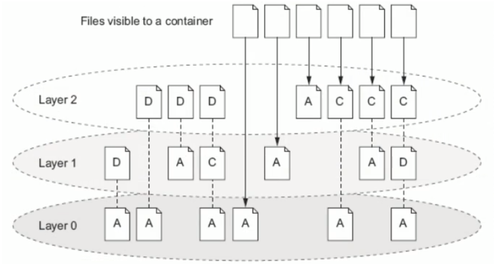
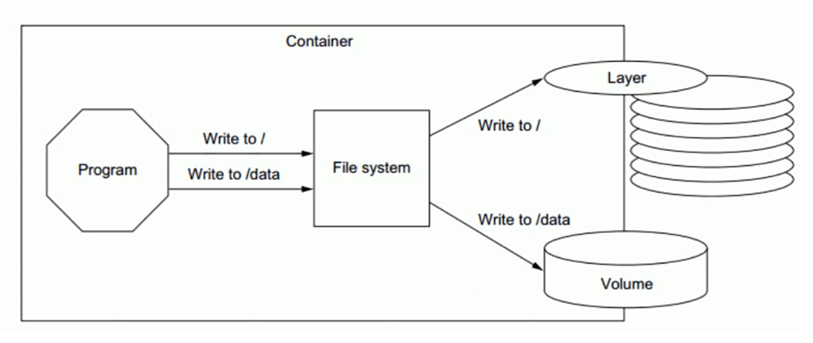
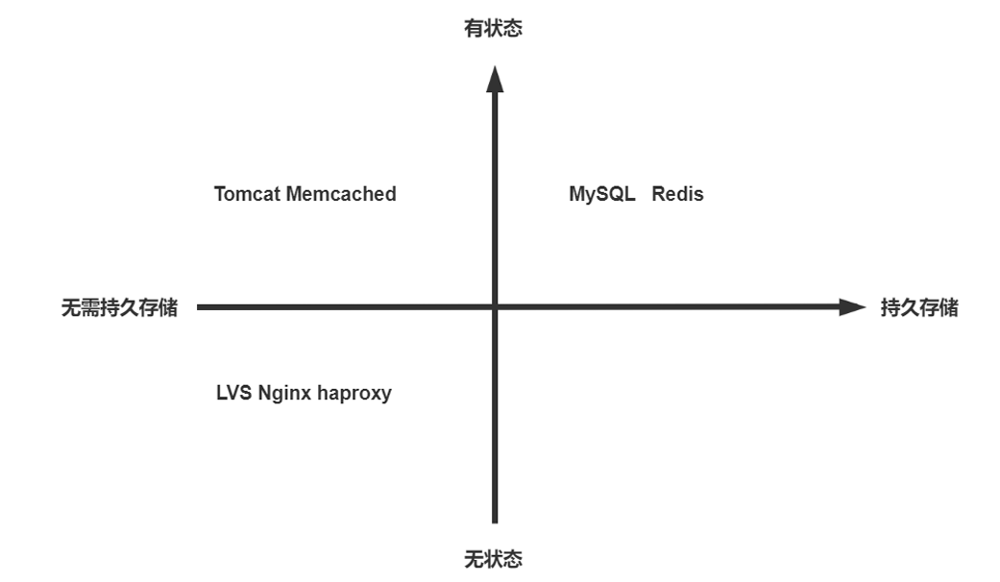
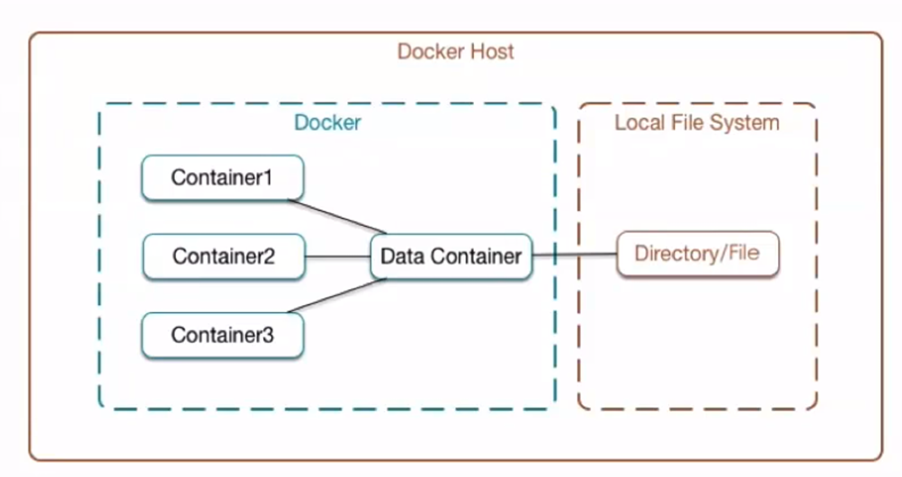
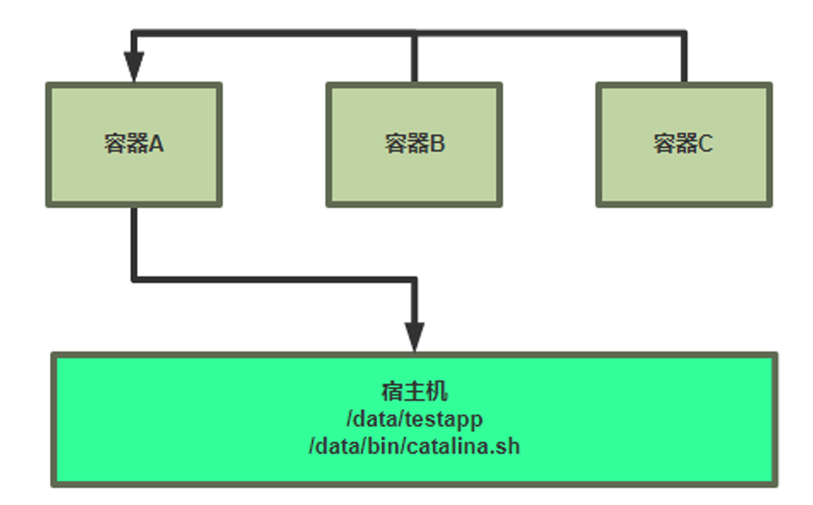

# Docker 数据管理



Docker镜像由多个只读层叠加而成，启动容器时，Docker会加载只读镜像层并在镜像栈顶部添加一个读 写层

如果运行中的容器修改了现有的一个已经存在的文件，那该文件将会从读写层下面的只读层复制到读写 层，该文件的只读版本仍然存在，只是已经被读写层中该文件的副本所隐藏，此即“写时复制(COW copy  on write)"机制

如果将正在运行中的容器修改生成了新的数据，那么新产生的数据将会被复制到读写层，进行持久化保 存，这个读写层也就是容器的工作目录，也为写时复制(COW) 机制。

COW机制节约空间,但会导致性低下,虽然关闭重启容器,数据不受影响,但会随着容器的删除,其对应的可写 层也会随之而删除,即数据也会丢失.如果容器需要持久保存数据,并不影响性能可以用数据卷技术实现

如下图是将对根的数据写入到了容器的可写层，但是把/data 中的数据写入到了一个另外的volume 中 用于数据持久化



## 容器的数据管理介绍

Docker镜像是分层设计的，镜像层是只读的，通过镜像启动的容器添加了一层可读写的文件系统，用户 写入的数据都保存在这一层中。

### Docker容器的分层

容器的数据分层目录

*   LowerDir:  image 镜像层,即镜像本身，只读
*   UpperDir:  容器的上层,可读写 ,容器变化的数据存放在此处
*   MergedDir:  容器的文件系统，使用Union FS（联合文件系统）将lowerdir 和 upperdir 合并完成 后给容器使用,最终呈现给用户的统一视图
*   WorkDir:  容器在宿主机的工作目录,挂载后内容会被清空，且在使用过程中其内容用户不可见


### 哪些数据需要持久化



## 容器数据持久保存方式

*   绑定挂载（Bind Mount）

    这种方式可以将指定的宿主机上的任意文件或目录挂载到容器内。与卷不同，绑定挂载依赖于宿主 机的文件系统结构。

    另外，由于绑定挂载可以访问宿主机上的任意文件和目录，使用这种方式可能会有一定的安全风 险。

*   卷（Volume）

    这是 Docker 推荐的挂载方式。卷是完全由 Docker 管理的文件目录，可以在容器之间共享和重 用。在创建卷时，Docker 创建了一个目录在宿主机上，然后将这个目录挂载到容器内。卷的主要 优点是你可以使用 Docker CLI 或 Docker API 来备份、迁移或者恢复卷，而无需关心卷在宿主机上 的具体位置。

    卷分为匿名卷和命名卷

*   tmpfs 挂载

    此方式并不算一种持久化方案

    tmpfs 挂载不与宿主机上的任何文件或目录相关联，而是将一个**内存空间的临时文件系统挂载到容 器的某个目录下。**

    这种方式的主要优点是它提供了一个高速且安全的挂载方式，因为 tmpfs 挂载通常驻留在宿主机的 内存中，且在容器停止后会被自动删除。

    tmpfs 挂载是临时的，只存留在容器宿主机的内存中。**当容器停止时，tmpfs 挂载文件路径将被删 除，在那里写入的文件不会被持久化。**

 Docker的卷（Volume）类型分为两种: 

*   数据卷(Data Volume):  直接将宿主机目录挂载至容器的指定的目录 ，推荐使用此种方式，此方式 较常用
    *   指定宿主机目录或文件: 指定宿主机的具体路径和容器路径的挂载关系，此方式不会创建数据卷
    *   匿名卷:  不指定数据名称,只指定容器内目录路径充当挂载点,docker自动指定宿主机的路径进行挂 载，此方式会创建匿名数据卷,Dockerfile中VOLUME指定的卷即为此种
    *   命名卷:  指定数据卷的名称和容器路径的挂载关系，此方式会创建命名数据卷
*   数据卷容器(Data Volume Container):  间接使用宿主机空间，数据卷容器是将宿主机的目录挂载至 一个专门的数据卷容器，然后让其他容器通过数据卷容器读写宿主机的数据 ，此方式不常用

数据卷容器(Data Volume Container):  间接使用宿主机空间，数据卷容器是将宿主机的目录挂载至 一个专门的数据卷容器，然后让其他容器通过数据卷容器读写宿主机的数据 ，此方式不常用

### tmpfs 

```shell
docker run -d --tmpfs /data --name test pod-test:v0.1
```

### 数据卷使用方法

```shell
docker run -v, --volume=[host-src:]container-dest[:<options>]

ro 从容器内对此数据卷是只读，不写此项默认为可读可写
rw 从容器内对此数据卷可读可写,此为默认值
host-src 宿主机目录如果不存在,会自动创建
container-dest 容器目录如果不存在,会自动创建
```

#### 绑定挂载

```shell
docker run -d  -p 80:80 --name nginx01 -v /data/nginx:/usr/share/nginx/html  nginx

# :前是路径，当前文件夹下文件也要写成./
```

#### 匿名卷

而匿名卷则是随着容器建立而建立，随着容器消亡而淹没于卷列表中（对于 docker run 匿名卷不会被自动 删除）。 因此匿名卷只存放无关紧要的临时数据，随着容器消亡，这些数据将失去存在的意义。

```shell
docker run --name nginx -v /etc/nginx nginx

# 在/var/lib/docker/volumes/下
```

#### 命名卷

有名字的卷，在用过一次后，以后挂载容器的时候还可以使用，因为有名字可以指定。所以一般需要保存的数 据使用命名卷保存。

```shell
docker volume  create vol1  #也可以事先不创建
docker run -d  -p 80:80 --name nginx01 -v vol1:/usr/share/nginx/html  nginx

# :前是卷名
# 在/var/lib/docker/volumes/下

docker run -d  --name mysql -p 3306:3306 -v /data/mysql/:/var/lib/mysql -e MYSQL_ROOT_PASSWORD=123456 mysql:8.0.29-oracle
```

## 管理数据卷命令

```shell
docker volume COMMAND

# 查看数据卷的挂载关系
docker inspect --format="{{.Mounts}}"  <容器ID>

# 删除所有数据卷
docker volume rm `docker volume ls -q`

# 创建命名卷并删除
docker volume create mysql-vol
docker volume ls
tree /var/lib/docker/volumes/
docker volume rm mysql-vol 
docker volume ls

# 删除不再使用的数据卷
docker volume prune  -f

```

## 数据卷容器

**数据卷容器的功能只是将数据挂载信息传递给了其它使用数据卷容器的容器,而数据卷容器本 身并不提供数据存储功能**



在Dockerfile中创建的是匿名数据卷,无法直接实现多个容器之间共享数据

**数据卷容器主要的功能是可以让数据在多个docker容器之间共享**

如下图所示: 即可以让B容器和C容器都可以访问A容器的内容，即可以实现A，B，C 三个容器之间的数据 读写共享。



相当于先要创建一个后台运行的容器作为 Server，用于提供数据卷，这个卷可以为其他容器提供数据存 储服务，其他使用此卷的容器作为client端 ，但此方法并不常使用

缺点:  因为依赖一个 Server  的容器，所以此 Server 容器出了问题，其它 Client容器都会受影响

```shell
docker run --volumes-from <数据卷容器>

# 数据卷服务器
docker run -d --name volume-server -v /data/bin/catalina.sh:/apps/tomcat/bin/catalina.sh:ro -v /data/testapp:/data/tomcat/webapps/testapp   tomcat-web:app1

# 数据卷客户端
docker run -d --name client1 --volumes-from volume-server -p 8081:8080  tomcat-web:app1
docker run -d --name client2 --volumes-from volume-server -p 8082:8080  tomcat-web:app1

# 关闭卷容器Server，仍然可以创建新的client容器及访问旧的client容器
docker stop volume-server

# 删除数据卷容器后，旧的client 容器仍能访问，但无法再创建新的client容器
# 删除数据卷容器后，旧的client 容器仍能访问，但无法再创建基于数据卷容器的新的client容器,但可以创建基于已创建的Client容器的Client容器
docker rm -fv volume-server

```

**利用数据卷容器备份指定容器的数据卷实现**

由于匿名数据卷在宿主机中的存储位置不确定,所以为了方便的**备份匿名数据卷**,可以利用数据卷容器实现 数据卷的备份

```shell
# 备份
docker run -it --rm --volumes-from [container name] -v $(pwd):/backup ubuntu

[container name]            #表示需要备份的匿名数据卷的容器
[container data volume]     #表示容器内的需要备份的匿名数据卷对应的目录

# 还原
docker run -it --rm --volumes-from [container name] -v $(pwd):/backup ubuntu


# 此容器需要备份匿名卷
# 容器内的/datavolume1需要备份
docker run -it -v /datavolume1  --name volume-server centos bash

# 备份
# 此容器中有前面容器的匿名卷与自己的绑定挂载
docker run -it --rm --volumes-from volume-server -v ~/backup:/backup --name backup-server ubuntu
# 容器中，进入匿名卷挂载目录，将其中数据归档至绑定挂载，到宿主机的本地
cd /datavolume1/
tar cvf /backup/data.tar .
exit

#删除容器的数据
docker start -i volume-server
rm -rf /datavolume1/*
exit

# 还原
# 将宿主机的本地备份还原至匿名卷挂载目录
docker run --rm --volumes-from volume-server -v ~/backup:/backup --name backup-server ubuntu tar xvf /backup/data.tar -C /datavolume1/
```

利用数据卷容器备份MySQL数据库

```shell
# MySQL容器默认使用了匿名卷
docker run -d  --name mysql -p 3306:3306 -e MYSQL_ROOT_PASSWORD=123456  mysql:5.7.30

# 备份
docker run -it --rm --volumes-from mysql  -v $(pwd):/backup centos tar xvf  /backup/mysql.tar -C  /var/lib/mysql

# 还原
docker run -it --rm --volumes-from mysql  -v $(pwd):/backup centos tar xvf  /backup/mysql.tar -C  /
```

# Docker 网络管理