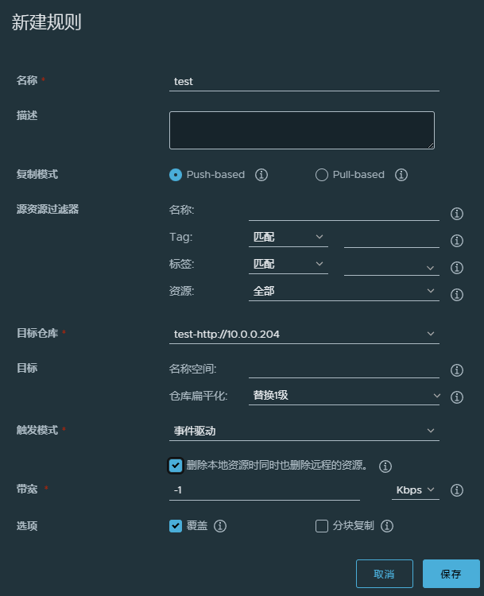
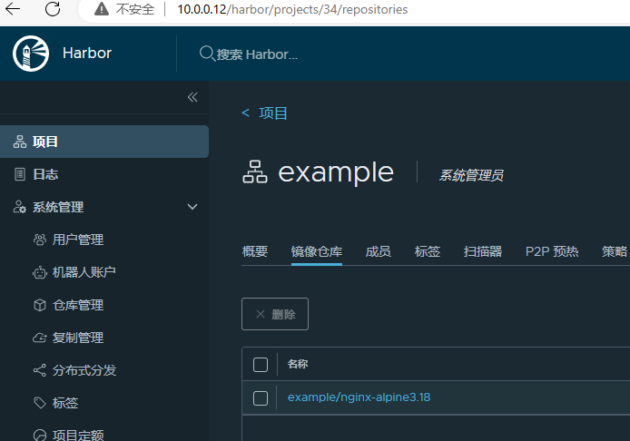
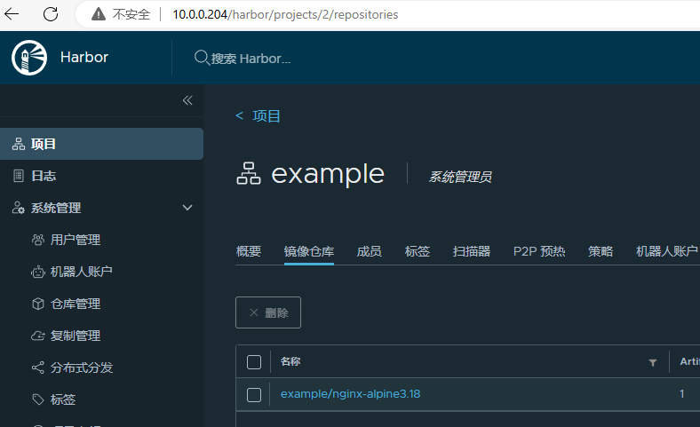

# 如何防止容器的数据因为容器销毁造成的数据丢失

1.   使用卷（Volume）

     *   `docker run -v my_volume:/data`命名卷
     *   `docker run -v /data`匿名卷

2.   绑定挂载（Bind Mount）

     *   docker run`-v /host/path:/container/path`

3.   tmpfs 挂载

     *   tmpfs 挂载是临时的，只存留在容器宿主机的内存中。当容器停止时，tmpfs 挂载文件路径将被删 除，在那里写入的文件不会被持久化。

     *   `docker run --tmpfs /data`

# docker导出镜像有两种方式，分别是什么，有什么区别，为什么（提示：两种方式导出的镜像大小 有明细差异）

```shell
# 导出镜像
# docker save 会完整地保存镜像的所有内容，包括每一层的变更、所有的元数据、所有的标签等。
docker save `docker images | awk 'NR!=1{print $1":"$2}'` | gzip >  all.tar.gz

# 导出容器
# 不会包含该容器的历史（也就是每个层的变更），并且也不会包含容器 的环境变量、元数据和其他相关的配置信息。
docker export nginx -o nginx.tar
```


# 我在镜像管理服务推送了第一版镜像，然后你先去仓库管理服务器上下载，然后我后面又升级了一 个版本，是同一个服务，当然，image的版本号肯定会增加，然后发现第一版下载很慢，第二次就 很快，为什么？

Docker 在下载和推送镜像时使用了**分层存储（Layered Storage）**

**如果某些层已经存在(第一次已经下载)**，Docker **不会重复下载这些层**。

只会**下载新的 Layer**，极大地减少了下载数据量，使下载速度变快。


# docker有几种网络模型，分别是什么

5种

*   host模式，使用宿主机网络

*   bridge模式，桥接到docker0网桥上

*   none模式，无网络

*   container模式，容器之间共享网络栈，适用于需要密切协作的容器

    `docker run --network container:my_existing_container my_image`

*   自定义网桥，用自定义的网桥代替默认的docker0，可通过容器名称互联

# dockerfile中，add和copy的区别是什么?

**`COPY`**: 将文件或目录从主机复制到 Docker 镜像中的指定位置。**它仅仅是复制**，没有任何额外的处理。

**`ADD`**: 除了具有与 `COPY` 相同的功能外，`ADD` 还具有**额外的特性**，比如支持从远程 URL 下载文件、解压 `.tar` 文件等。

# dockerfile中，比较run, entrypoint, cmd 三者的区别

*   `RUN` 用于在 **镜像构建过程中** 执行命令。

    `RUN` 用于安装软件、修改文件系统或配置环境。执行完毕后，指令会**创建一个新的镜像层**。

    不可以被覆盖（它是构建时的一部分）

*   `ENTRYPOINT` 用于为容器指定一个**默认的可执行命令**，容器启动时会执行该命令。

     `ENTRYPOINT` 指定的命令会在容器启动时执行，每次容器启动时都会执行。

    如果同时指定了 `CMD` 和 `ENTRYPOINT`，`CMD` 会作为 `ENTRYPOINT` 的参数传递给命令，但不会覆盖 `ENTRYPOINT`。

    如果只定义了 `ENTRYPOINT`，但没有指定 `CMD`，那么容器启动时只能执行 `ENTRYPOINT` 指定的命令，不能通过 `docker run` 覆盖命令。

*   `CMD` 用于为容器提供**默认的命令或参数**，但**可以被 `docker run` 命令覆盖**。`CMD` 是容器启动时的默认执行命令，也可以作为 `ENTRYPOINT` 的附加参数。


# 分析bridge模式下，docker上部署个容器，它上面的流量流入路径，和流量流出路径分别是什么？

流量流入

 `外网IP,宿主机IP:80` 到达宿主机`eth0`，

宿主机`iptables DNAT`转换`外网IP,容器IP:80`

宿主机 `iptables` 会匹配 `FORWARD` 规则，允许流量继续流入 `docker0`。

`docker0` 网桥将流量发送到 **容器的虚拟网卡 `vethXXX`**，最终交给容器内部的 Web 服务处理


流量流出

`容器IP，外网IP` 过其 **虚拟网卡**进入 **`docker0` 网桥**

宿主机`iptables SNAT`转换`宿主机IP,外网IP`

数据包经过宿主机的物理网卡（如 `eth0`），然后被发送到外部网络。

# 总结dockerfile的最佳实践（最少写3种）

*   选择合适的父镜像

*   将多个可合并的`Run`合并, 减少镜像层数，优化镜像构建。

*   使用完软件后，删除不必要的软件包

*   利用多阶段构建

*   使用 `.dockerignore` 文件
*   结合 `ENTRYPOINT` 和 `CMD` 使用

# 实验：编写dockerfile多阶段构建Nginx

```shell
wget http://nginx.org/download/nginx-1.24.0.tar.gz
```

nginx.conf

```shell
user nginx;

worker_processes  1;

events {
    worker_connections  1024;
}


http {
    include       mime.types;
    default_type  application/octet-stream;

    sendfile        on;
    keepalive_timeout  65;

    server {
        listen       80;
        server_name  localhost;

        location / {
            root   html;
            index  index.html index.htm;
        }

        error_page   500 502 503 504  /50x.html;
        location = /50x.html {
            root   html;
        }
    }

}
```


```dockerfile
ARG VERSION=3.18.0
FROM alpine:$VERSION

ENV NGINX_VERSION=1.24.0 NGINX_DIR=/apps/nginx

ADD http://nginx.org/download/nginx-1.24.0.tar.gz /usr/local/src/

RUN  sed -i 's/dl-cdn.alpinelinux.org/mirrors.ustc.edu.cn/' /etc/apk/repositories  && \
     apk update && \
     apk --no-cache add gcc make libgcc libc-dev libcurl libc-utils pcre-dev zlib-dev libnfs pcre pcre2  net-tools curl pstree wget libevent libevent-dev iproute2 openssl-dev && \
     cd /usr/local/src/nginx-$NGINX_VERSION && \
     ./configure  --prefix=${NGINX_DIR} --user=nginx --group=nginx --with-http_ssl_module --with-http_v2_module --with-http_realip_module --with-http_stub_status_module --with-http_gzip_static_module --with-pcre --with-stream --with-stream_ssl_module --with-stream_realip_module && \
     make && make install && \
     rm -rf /usr/local/src/nginx-$NGINX_VERSION
     
COPY nginx.conf ${NGINX_DIR}/conf/nginx.conf

FROM alpine:$VERSION

ENV NGINX_DIR=/apps/nginx

COPY --from=0 ${NGINX_DIR}/ ${NGINX_DIR}/

RUN  sed -i 's/dl-cdn.alpinelinux.org/mirrors.ustc.edu.cn/' /etc/apk/repositories && \
     apk update && apk --no-cache add tzdata curl pcre pcre2 && \
     ln -s  /usr/share/zoneinfo/Asia/Shanghai /etc/localtime && \
     ln -sf ${NGINX_DIR}/sbin/nginx  /usr/sbin/nginx && \
     addgroup -g 888 -S nginx && \
     adduser  -u 888 -G nginx -D -S -s /sbin/nologin nginx && \
     chown  -R  nginx.nginx  ${NGINX_DIR}/ && \
     ln -sf /dev/stdout ${NGINX_DIR}/logs/access.log && \
     ln -sf /dev/stderr ${NGINX_DIR}/logs/error.log
     
EXPOSE 80 443
CMD ["nginx","-g","daemon off;"]
```

```shell
docker build -t nginx-alpine3.18:1.24.0-v1 .

docker run -d -p 80:80 nginx-alpine3.18:1.24.0-v1
```


# 搭建Harbor，并实现Harbor的高可用，并将第9题中构建的Nginx镜像推送到Harbor上，同时观察 另一台Harbor上是否进行了同步

```shell
# 安装docker

# 安装docker-compose
apt -y install docker-compose

# 下载离线包
wget https://github.com/goharbor/harbor/releases/download/v2.12.2/harbor-offline-installer-v2.12.2.tgz
tar xvf harbor-offline-installer-v2.12.2.tgz

# 配置文件
cp harbor.yml.tmpl harbor.yml
vim harbor.yml
hostname = 10.0.0.101
harbor_admin_password = 123456
#如果不使用https，还需要将https行注释掉

# 运行安装脚本
./install.sh
```

俩harbor创建相同名称公开项目

仓库管理中创建推送目标

复制管理中创建推送规则



```shell
# 12
vim /etc/docker/daemon.json
{
 "insecure-registries": ["10.0.0.12", "10.0.0.204"]                                                                                                       
}
docker login -u admin -p Harbor12345 10.0.0.12

docker tag nginx-alpine3.18:1.24.0-v2 10.0.0.12/example/nginx-alpine3.18:1.24.0-v2
docker push 10.0.0.12/example/nginx-alpine3.18:1.24.0-v2
```



